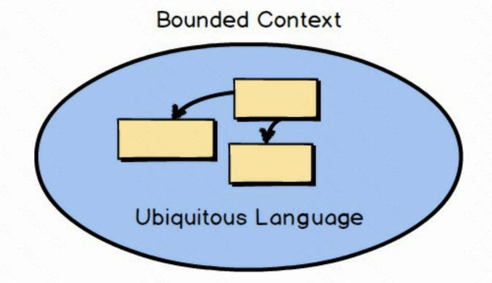
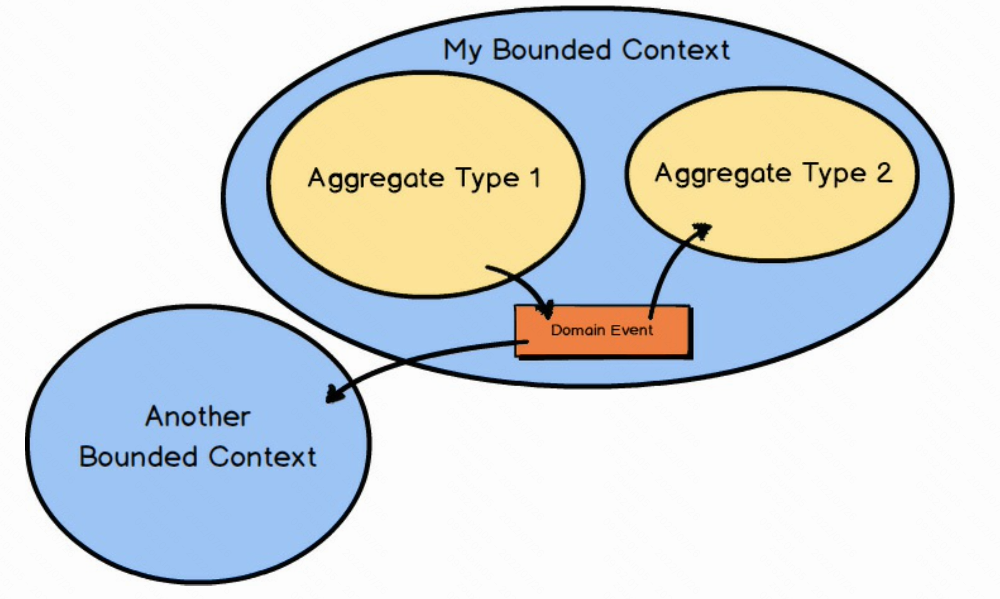

# DDD

## 战略设计

- 运用 **界限上下文（Bounded Context）** 的战略设计模式来分离领域模型。
- 在明确的界限上下文中发展一套领域模型的**通用语言（Ubiquitous Language）**。
- **子域（Subdomain）**用来处理遗留系统中的无边界的复杂性和改建新项目上的成果。
- **上下文影射（Context Maping）**用来集成多个界限上下文。
- **上下文影射图（Context map）**同时定义了两个进行集成的界限上下文之间的团队间关系及技术实现方式。

## 战术设计

- **聚合（Aggregate）** 模式将若干实体和值对象以恰当大小聚集在一起。
- 使用**领域事件（Domain Events）**既可以让你明确地建立模型，也可把模型内部发生的事情分享给需要知道这一切的系统。