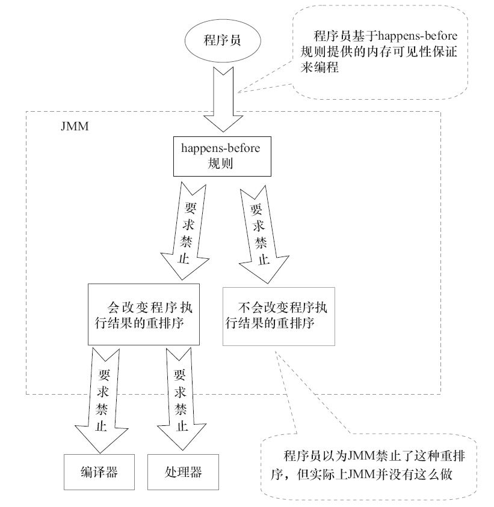

# Java内存可见性


## Java内存模型
Java内存模型（Java Memory Model）简称JMM。

### 线程通信机制

在命令式编程中，线程之间的通信机制有两种：**共享内存**和**消息传递**。需要处理两个关键问题：线程之间如何*通信*及线程之间如何*同步*。

在共享内存的并发模型里，线程之间共享程序的公共状态，通过写-读内存中的公共状态进行隐式通信。在消息传递的并发模型里，线程之间没有公共状态，线程之间必须通过发送消息来显式进行通信。

同步是指程序中用于控制不同线程间操作发生相对顺序的机制。在共享内存并发模型里，同步是显式进行的。程序员必须显式指定某个方法或某段代码需要在线程之间互斥执行。在消息传递的并发模型里，由于消息的发送必须在消息的接收之前，因此同步是隐式进行的。

JMM是一种**共享内存模型**，Java线程之间的通信总是隐式进行，整个通信过程对程序员完全透明。如果编写多线程程序的Java程序员不理解隐式进行的线程之间通信的工作机制，很可能会遇到各种奇怪的内存可见性问题。

### JMM

- **共享变量**：所有实例域、静态域和数组元素都存储在堆内存中，堆内存在线程之间共享。
- **局部变量**：方法定义参数和异常处理器参数不会在线程之间共享，它们不会有内存可见性问题，也不受内存模型的影响。

Java线程之间的通信由JMM控制，JMM决定一个线程对共享变量的写入何时对另一个线程可见。从抽象的角度来看，JMM定义了线程和主内存之间的抽象关系：线程之间的共享变量存储在主内存中，每个线程都有一个私有的本地内存，本地内存中存储了该线程以读/写共享变量的副本。本地内存是JMM的一个抽象概念，并不真实存在。它涵盖了缓存、写缓冲区、寄存器以及其他的硬件和编译器优化。


Java线程的通信过程必须要经过主内存。JMM通过控制主内存与每个线程的本地内存之间的交互，来为Java程序员提供内存可见性保证。

### JMM特性

按程序类型，Java程序的内存可见性保证可以分为下列3类。

- 单线程程序。单线程程序不会出现内存可见性问题。编译器、runtime和处理器会共同确保单线程程序的执行结果与该程序在顺序一致性模型中的执行结果相同。
- 正确同步的多线程程序。正确同步的多线程程序的执行将具有顺序一致性（程序的执行结果与该程序在顺序一致性内存模型中的执行结果相同）。这是JMM关注的重点，JMM通过限制编译器和处理器的重排序来为程序员提供内存可见性保证。
- 未同步/未正确同步的多线程程序。JMM为它们提供了最小安全性保障：线程执行时读取到的值，要么是之前某个线程写入的值，要么是默认值（0、null、false）。

还需要注意的是，JMM不保证对64位的long型和double型变量的写操作具有原子性。

## 处理器内存模型

根据对不同类型的读/写操作组合的执行顺序的放松，可以把常见处理器的内存模型划分为如下几种类型。

- 放松程序中写-读操作的顺序，由此产生了Total Store Ordering内存模型（简称为TSO）。
- 在上面的基础上，继续放松程序中写-写操作的顺序，由此产生了Partial Store Order内存模型（简称为PSO）。
- 在前面两条的基础上，继续放松程序中读-写和读-读操作的顺序，由此产生了Relaxed Memory Order内存模型（简称为RMO）和PowerPC内存模型。

注意：处理器在保证单线程不改变程序执行结果的前提下对读/写操作的放松来达到优化程序性能的目的 —— 处理器要遵守**as-if-serial**语义。


上表中的各种处理器内存模型，从上到下，模型由强变弱。越是追求性能的处理器，内存模型设计得会越弱。因为这些处理器希望内存模型对它们的束缚越少越好，这样它们就可以做尽可能多的优化来提高性能。

由于常见的处理器内存模型比JMM要弱，Java编译器在生成字节码时，会在执行指令序列的适当位置插入内存屏障来限制处理器的重排序。同时，由于各种处理器内存模型的强弱不同，为了在不同的处理器平台向程序员展示一个一致的内存模型，JMM在不同的处理器中需要插入的内存屏障的数量和种类也不相同。JMM屏蔽了不同处理器内存模型的差异，它在不同的处理器平台之上为Java程序员呈现了一个一致的内存模型。


### 写缓冲与读写重排序

从上表可以看到，所有处理器内存模型都允许写-读重排序：这是由于现代的处理器都使用了**写缓冲区**。

写缓冲区可以保证指令流水线持续运行，它可以避免由于处理器停顿下来等待向内存写入数据而产生的延迟。同时，通过以批处理的方式刷新写缓冲区，以及合并写缓冲区中对同一内存地址的多次写，减少对内存总线的占用。虽然写缓冲区有这么多好处，但每个处理器上的写缓冲区，仅仅对它所在的处理器可见。这个特性会对内存操作的执行顺序产生重要的影响：处理器对内存的读/写操作的执行顺序，不一定与内存实际发生的读/写操作顺序一致！


这里处理器A和处理器B可以同时把共享变量写入自己的写缓冲区（A1，B1），然后从内存中读取另一个共享变量（A2，B2），最后才把自己写缓存区中保存的脏数据刷新到内存中（A3，B3）。当以这种时序执行时，程序就可以得到x=y=0的结果。

从内存操作实际发生的顺序来看，直到处理器A执行A3来刷新自己的写缓存区，写操作A1才算真正执行了。虽然处理器A执行内存操作的顺序为：A1→A2，但内存操作实际发生的顺序却是A2→A1。此时，处理器A的内存操作顺序被重排序了。

写缓存区可能导致写-读操作重排序。同时，我们可以看到这些处理器内存模型都允许更早读到当前处理器的写，原因同样是因为写缓存区。由于写缓存区仅对当前处理器可见，这个特性导致当前处理器可以比其他处理器先看到临时保存在自己写缓存区中的写，而其他处理器要等到写缓冲写入到主内存后从内存中读取才能读到。由于现代的处理器都会使用写缓冲区，因此现代的处理器都会允许对写-读操作进行重排序。


## 顺序一致性模型

顺序一致性内存模型是一个被计算机科学家理想化了的理论参考模型，它为程序员提供了极强的内存可见性保证。顺序一致性内存模型有两大特性。

1. 一个线程中的所有操作必须按照程序的顺序来执行。
2. （不管程序是否同步）所有线程都只能看到一个单一的操作执行顺序。在顺序一致性内存模型中，每个操作都必须原子执行且立刻对所有线程可见。


在概念上，顺序一致性模型有一个单一的全局内存，这个内存通过一个左右摆动的开关可以连接到任意一个线程，同时每一个线程必须按照程序的顺序来执行内存读/写操作。从上面的示意图可以看出，在任意时间点最多只能有一个线程可以连接到内存。当多个线程并发执行时，图中的开关装置能把所有线程的所有内存读/写操作串行化（即在顺序一致性模型中，所有操作之间具有全序关系）。


### 同步线程的顺序一致模型和JMM

顺序一致性模型中，所有操作完全按程序的顺序串行执行。而在JMM中，临界区内的代码可以重排序（但JMM不允许临界区内的代码“逸出”到临界区之外，那样会破坏监视器的语义）。JMM会在退出临界区和进入临界区这两个关键时间点做一些特别处理，使得线程在这两个时间点具有与顺序一致性模型相同的内存视图。


### 未同步线程的顺序一致性模型和JMM

对于未同步或未正确同步的多线程程序，JMM只提供**最小安全性**：线程执行时读取到的值，要么是之前某个线程写入的值，要么是默认值（0，Null，False），JMM保证线程读操作读取到的值不会无中生有（Out Of Thin Air）的冒出来。为了实现最小安全性，JVM在堆上分配对象时，首先会对内存空间进行清零，然后才会在上面分配对象（JVM内部会同步这两个操作）。因此，在已清零的内存空间（Pre-zeroed Memory）分配对象时，域的默认初始化已经完成了。

JMM不保证未同步程序的执行结果与该程序在顺序一致性模型中的执行结果一致。因为如果想要保证执行结果一致，JMM需要禁止大量的处理器和编译器的优化，这对程序的执行性能会产生很大的影响。而且未同步程序在顺序一致性模型中执行时，整体是无序的，其执行结果往往无法预知。而且，保证未同步程序在这两个模型中的执行结果一致没什么意义。

未同步程序在JMM中的执行时，整体上是无序的，其执行结果无法预知。未同步程序在两个模型中的执行特性有如下几个差异。

1. 顺序一致性模型保证单线程内的操作会按程序的顺序执行，而JMM不保证单线程内的操作会按程序的顺序执行（比如上面正确同步的多线程程序在临界区内的重排序）。
2. 顺序一致性模型保证所有线程只能看到一致的操作执行顺序，而JMM不保证所有线程能看到一致的操作执行顺序。这一点前面也已经讲过，这里就不再赘述。比如，在当前线程把写过的数据缓存在本地内存中，在没有刷新到主内存之前，这个写操作仅对当前线程可见；从其他线程的角度来观察，会认为这个写操作根本没有被当前线程执行。只有当前线程把本地内存中写过的数据刷新到主内存之后，这个写操作才能对其他线程可见。在这种情况下，当前线程和其他线程看到的操作执行顺序将不一致。
3. JMM不保证对64位的long型和double型变量的写操作具有原子性，而顺序一致性模型保证对所有的内存读/写操作都具有原子性。


## 重排序

**重排序**是指*编译器和处理器为了优化程序性能而对指令序列进行重新排序的一种手段*。

### 数据依赖性

*如果两个操作访问同一个变量，且这两个操作中有一个为写操作*，此时这两个操作之间就存在**数据依赖性**。


上面3种情况，只要重排序两个操作的执行顺序，程序的执行结果就会被改变。

编译器和处理器可能会对操作做重排序。编译器和处理器在重排序时，会遵守数据依赖性，编译器和处理器不会改变存在数据依赖关系的两个操作的执行顺序。这里所说的数据依赖性仅针对单个处理器中执行的指令序列和单个线程中执行的操作，不同处理器之间和不同线程之间的数据依赖性不被编译器和处理器考虑。

### as-if-serial语义

**as-if-serial语义**的意思是：*不管怎么重排序（编译器和处理器为了提高并行度），（单线程）程序的执行结果不能被改变*。编译器、runtime和处理器都必须遵守as-if-serial语义。

为了遵守as-if-serial语义，编译器和处理器不会对存在数据依赖关系的操作做重排序，因为这种重排序会改变执行结果。但是，如果操作之间不存在数据依赖关系，这些操作就可能被编译器和处理器重排序。

- 在单线程程序中，在as-if-serial语义的控制下，重排之后的执行结果和顺序一致模型的执行结果一致；
- 但在多线程程序中，即使在as-if-serial语义的控制下也有可能会改变程序的执行结果。可以通过使用同步原语阻止特定的重排使操作的可见的方式来保证和顺序一致模型的执行结果一致。

## happens-before

从JDK 5开始，Java使用新的JSR-133内存模型。JSR-133使用happens-before的概念来阐述操作之间的内存可见性。



从上图可以看出两点：

- JMM向程序员提供的happens-before规则能满足程序员的需求。JMM的happens-before规则不但简单易懂，而且也向程序员提供了足够强的内存可见性保证。
- JMM对编译器和处理器的束缚已经尽可能少。从上面的分析可以看出，JMM其实是在遵循一个基本原则：只要不改变程序的执行结果（指的是单线程程序和正确同步的多线程程序），编译器和处理器怎么优化都行。例如，如果编译器经过细致的分析后，认定一个锁只会被单个线程访问，那么这个锁可以被消除。再如，如果编译器经过细致的分析后，认定一个volatile变量只会被单个线程访问，那么编译器可以把这个volatile变量当作一个普通变量来对待。这些优化既不会改变程序的执行结果，又能提高程序的执行效率。

### happens-before定义

1. 如果一个操作happens-before另一个操作，那么第一个操作的执行结果将对第二个操作可见，而且第一个操作的执行顺序排在第二个操作之前。
2. 两个操作之间存在happens-before关系，并不意味着Java平台的具体实现必须要按照happens-before关系指定的顺序来执行。如果重排序之后的执行结果，与按happens-before关系来执行的结果一致，那么这种重排序并不非法（也就是说，JMM允许这种重排序）。

上面的 1. 是JMM对程序员的承诺 。从程序员的角度来说，可以这样理解happens-before关系：如果A happens-before B，那么Java内存模型将向程序员保证——A操作的结果将对B可见，且A的执行顺序排在B之前。注意，这只是Java内存模型向程序员做出的保证！

上面的 2. 是JMM对编译器和处理器重排序的约束原则 。正如前面所言，JMM其实是在遵循一个基本原则：只要不改变程序的执行结果（指的是单线程程序和正确同步的多线程程序），编译器和处理器怎么优化都行。JMM这么做的原因是：程序员对于这两个操作是否真的被重排序并不关心，程序员关心的是程序执行时的语义不能被改变（即执行结果不能被改变）。因此，happens-before关系本质上和as-if-serial语义是一回事。

- as-if-serial语义保证单线程内程序的执行结果不被改变，happens-before关系保证正确同步的多线程程序的执行结果不被改变。
- as-if-serial语义给编写单线程程序的程序员创造了一个幻境：单线程程序是按程序的顺序来执行的。happens-before关系给编写正确同步的多线程程序的程序员创造了一个幻境：正确同步的多线程程序是按happens-before指定的顺序来执行的。

*as-if-serial语义和happens-before这么做的目的，都是为了在不改变程序执行结果的前提下，尽可能地提高程序执行的并行度*。

### happens-before规则

1. 程序顺序规则：一个线程中的每个操作，happens-before于该线程中的任意后续操作。
2. 监视器锁规则：对一个锁的解锁，happens-before于随后对这个锁的加锁。
3. volatile变量规则：对一个volatile域的写，happens-before于任意后续对这个volatile域的读。
4. 传递性：如果A happens-before B，且B happens-before C，那么A happens-before C。
5. start()规则：如果线程A执行操作ThreadB.start()（启动线程B），那么A线程的ThreadB.start()操作happens-before于线程B中的任意操作。
6. join()规则：如果线程A执行操作ThreadB.join()并成功返回，那么线程B中的任意操作happens-before于线程A从ThreadB.join()操作成功返回。

注：加锁happens-before解锁体现在第一条规则中。因为通常情况下，程序中一定是要先进行加锁后解锁的。

## 各个内存模型之间的关系

JMM是一个**语言级的内存模型**，处理器内存模型是**硬件级的内存模型**，顺序一致性内存模型是一个**理论参考模型**。下面是语言内存模型、处理器内存模型和顺序一致性内存模型的强弱对比示意图。


从图中可以看出：常见的4种处理器内存模型比常用的3中语言内存模型要弱，处理器内存模型和语言内存模型都比顺序一致性内存模型要弱。同处理器内存模型一样，越是追求执行性能的语言，内存模型设计得会越弱。


## volatile的内存语义

### volatile特性

- 原子性：对任意单个volatile变量的读/写具有原子性，但类似于volatile++这种复合操作不具有原子性。
    - 处理器提供**总线锁定**或**缓存锁定**两个机制来保证复杂内存操作的原子性，使得同一时间仅允许一个处理器对共享内存进行操作。
- 可见性：对一个volatile变量的读，总是能看到（任意线程）对这个volatile变量最后的写入。
    - 使用**MESI**（修改、独占、共享、无效）控制协议去维护内部缓存和其他处理器缓存的一致性，进而保证可见性。

### volatile写-读的内存语义

- 当写一个volatile变量时，JMM会把该线程对应的本地内存中的共享变量值刷新到主内存。
- 当读一个volatile变量时，JMM会把该线程对应的本地内存置为无效。线程接下来将从主内存中读取共享变量。

### volatile内存语义的实现

为了实现volatile内存语义，JMM会分别限制这两种类型的重排序类型。


从表中可以看出：

- 当第二个操作是volatile写时，不管第一个操作是什么，都不能重排序。这个规则确保volatile写之前的操作不会被编译器重排序到volatile写之后。
- 当第一个操作是volatile读时，不管第二个操作是什么，都不能重排序。这个规则确保volatile读之后的操作不会被编译器重排序到volatile读之前。
- 当第一个操作是volatile写，第二个操作是volatile读时，不能重排序。

上述内存屏障插入策略非常保守，但它可以保证在任意处理器平台，任意的程序中都能得到正确的volatile内存语义。

下面是保守策略下，volatile写插入内存屏障后生成的指令序列示意图。


StoreStore屏障可以保证在volatile写之前，其前面的所有普通写操作已经对任意处理器可见了。这是因为StoreStore屏障将保障上面所有的普通写在volatile写之前刷新到主内存。volatile写后面的StoreLoad屏障。此屏障的作用是避免volatile写与后面可能有的volatile读/写操作重排序。

下面是在保守策略下，volatile读插入内存屏障后生成的指令序列示意图。


LoadLoad屏障用来禁止处理器把上面的volatile读与下面的普通读重排序。LoadStore屏障用来禁止处理器把上面的volatile读与下面的普通写重排序。

上述volatile写和volatile读的内存屏障插入策略非常保守。在实际执行时，只要不改变volatile写-读的内存语义，编译器可以根据具体情况省略不必要的屏障。

### JSR-133为什么要增强volatile的内存语义?（为什么禁止volatile变量与普通变量的重排序）

在JSR-133之前的旧Java内存模型中，虽然不允许volatile变量之间重排序，但旧的Java内存模型允许volatile变量与普通变量重排序。因此，在旧的内存模型中，volatile的写-读没有锁的释放-获所具有的内存语义。为了提供一种比锁更轻量级的线程之间通信的机制，JSR-133专家组决定增强volatile的内存语义：严格限制编译器和处理器对volatile变量与普通变量的重排序，确保volatile的写-读和锁的释放-获取具有相同的内存语义。从编译器重排序规则和处理器内存屏障插入策略来看，只有volatile变量与普通变量之间的重排序可能会破坏volatile的内存语义，这种重排序就会被编译器重排序规则和处理器内存屏障插入策略禁止。

## 锁的内存语义

### 锁的释放和获取的内存语义

- 当线程释放锁时，JMM会把该线程对应的本地内存中的共享变量刷新到主内存中。
- 当线程获取锁时，JMM会把该线程对应的本地内存置为无效。从而使得被监视器保护的临界区代码必须从主内存中读取共享变量。

对比锁释放-获取的内存语义与volatile写-读的内存语义可以看出：锁释放与volatile写有相同的内存语义；锁获取与volatile读有相同的内存语义。

### 锁内存语义的实现

- 公平锁和非公平锁释放时，最后都要写一个volatile变量state。该操作具有volatile写的内存语义。
- 公平锁获取时，首先会去读volatile变量。该操作语句volatile读的内存语义。
- 非公平锁获取时，首先会用CAS更新volatile变量，这个操作同时具有volatile读和volatile写的内存语义。

### concurrent包的实现

由于Java的CAS同时具有volatile读和volatile写的内存语义，因此Java线程之间的通信现在有了下面4种方式。

1. A线程写volatile变量，随后B线程读这个volatile变量。
2. A线程写volatile变量，随后B线程用CAS更新这个volatile变量。
3. A线程用CAS更新一个volatile变量，随后B线程用CAS更新这个volatile变量。
4. A线程用CAS更新一个volatile变量，随后B线程读这个volatile变量。

## final域的内存语义

### final域的重排序规则

对于final域，编译器和处理器要遵守两个重排序规则。

1. 在构造函数内对一个*final域*或者*final域对象成员*的写入，与随后把这个被构造对象的引用赋值给一个引用变量，这两个操作之间不能重排序。
2. 初次读一个包含final域的对象的引用，与随后初次读这个final域，这两个操作之间不能重排序。

### 写final域的实现

写final域的重排序规则禁止把*final域*或者*final域对象成员*的写重排序到构造函数之外。这个规则的实现包含下面2个方面。

1. JMM禁止编译器把*final域*或者*final域对象成员*的写重排序到构造函数之外。
2. 编译器会在final域的写之后，构造函数return之前，插入一个StoreStore屏障。这个屏障禁止处理器把final域的写重排序到构造函数之外。


由于X86处理器不会对写-写操作做重排序，所以在X86处理器中，写final域需要的StoreStore障屏会被省略掉。

### 读final域的实现

读final域的重排序规则是，在一个线程中，初次读对象引用与初次读该对象包含的final域，JMM禁止处理器重排序这两个操作（注意，这个规则仅仅针对处理器）。编译器会在读final域操作的前面插入一个LoadLoad屏障。


同样，由于X86处理器不会对存在间接依赖关系的操作做重排序，所以在X86处理器中，读final域需要的LoadLoad屏障也会被省略掉。

### 为什么 final 引用不能从构造器内“逸出”？

前面我们提到过，写final域的重排序规则可以确保：在引用变量为任意线程可见之前，该引用变量指向的对象的final域已经在构造函数中被正确初始化过了。其实，要得到这个效果，还需要一个保证：在构造函数内部，不能让这个被构造对象的引用为其他线程所见，也就是对象引用不能在构造函数中“逸出”。


在构造函数返回前，被构造对象的引用不能为其他线程所见，因为此时的final域可能还没有被初始化。在构造函数返回后，任意线程都将保证能看到final域正确初始化之后的值。

### JSR-133为什么要增强final的语义

在旧的Java内存模型中，一个最严重的缺陷就是线程可能看到final域的值会改变。比如，一个线程当前看到一个整型final域的值为0（还未初始化之前的默认值），过一段时间之后这个线程再去读这个final域的值时，却发现值变为1（被某个线程初始化之后的值）。最常见的例子就是在旧的Java内存模型中，String的值可能会改变。

为了修补这个漏洞，JSR-133专家组增强了final的语义。通过为final域增加写和读重排序规则，可以为Java程序员提供初始化安全保证：只要对象是正确构造的（被构造对象的引用在构造函数中没有“逸出”），那么不需要使用同步（指lock和volatile的使用）就可以保证任意线程都能看到这个final域在构造函数中被初始化之后的值。

## 双重检查锁定与延迟初始化

在Java程序中，有时候可能需要推迟一些高开销的对象初始化操作，并且只有在使用这些对象时才进行初始化。此时，程序员可能会采用延迟初始化。但要正确实现线程安全的延迟初始化需要一些技巧，否则很容易出现问题。

在早期的JVM中，synchronized（甚至是无竞争的synchronized）存在巨大的性能开销。因此，人们想出了一个“聪明”的技巧：双重检查锁定（Double-Checked Locking）。人们想通过双重检查锁定来降低同步的开销。下面是使用双重检查锁定来实现延迟初始化的示例代码。

```java
public class DoubleCheckedLocking {                      // 1
    private static Instance instance;                    // 2
    public static Instance getInstance() {               // 3
        if (instance == null) {                          // 4:第一次检查
            synchronized (DoubleCheckedLocking.class) {  // 5:加锁
                if (instance == null)                    // 6:第二次检查
                    instance = new Instance();           // 7:问题的根源出在这里
            }                                            // 8
        }                                                // 9
        return instance;                                 // 10
    }                                                    // 11
}
```

如上面代码所示，如果第一次检查instance不为null，那么就不需要执行下面的加锁和初始化操作。因此，可以大幅降低synchronized带来的性能开销。上面代码表面上看起来，似乎两全其美。

- 多个线程试图在同一时间创建对象时，会通过加锁来保证只有一个线程能创建对象。
- 在对象创建好之后，执行getInstance()方法将不需要获取锁，直接返回已创建好的对象。

双重检查锁定看起来似乎很完美，但这是一个错误的优化！在线程执行到第4行，代码读取到instance不为null时，instance引用的对象有可能还没有完成初始化。

### 问题根源

前面的双重检查锁定示例代码的第7行（instance=new Singleton();）创建了一个对象。这一行代码可以分解为如下的3行伪代码。

```java
memory = allocate();　　// 1：分配对象的内存空间
ctorInstance(memory);　 // 2：初始化对象
instance = memory;　　  // 3：设置instance指向刚分配的内存地址
```

上面3行伪代码中的2和3之间，可能会被重排序（在一些JIT编译器上，这种重排序是真实发生的，详情见参考文献1的“Out-of-order writes”部分）。2和3之间重排序之后的执行时序如下。

```java
memory = allocate();　　// 1：分配对象的内存空间
instance = memory;　　  // 3：设置instance指向刚分配的内存地址                                       
                        // 注意，此时对象还没有被初始化！
ctorInstance(memory);　 // 2：初始化对象
```

根据《The Java Language Specification,Java SE 7 Edition》（后文简称为Java语言规范），所有线程在执行Java程序时必须要遵守intra-thread semantics。intra-thread semantics保证重排序不会改变单线程内的程序执行结果。换句话说，intra-thread semantics允许那些在单线程内，不会改变单线程程序执行结果的重排序。上面3行伪代码的2和3之间虽然被重排序了，但这个重排序并不会违反intra-thread semantics。这个重排序在没有改变单线程程序执行结果的前提下，可以提高程序的执行性能。


DoubleCheckedLocking示例代码的第7行（instance=new Singleton();）如果发生重排序，另一个并发执行的线程B就有可能在第4行判断instance不为null。线程B接下来将访问instance所引用的对象，但此时这个对象可能还没有被A线程初始化！

在知晓了问题发生的根源之后，我们可以想出两个办法来实现线程安全的延迟初始化。

1. 不允许2和3重排序。
2. 允许2和3重排序，但不允许其他线程“看到”这个重排序。

后文介绍的两个解决方案，分别对应于上面这两点。

### 基于volatile的解决方案

对于前面的基于双重检查锁定来实现延迟初始化的方案（指DoubleCheckedLocking示例代码），只需要做一点小的修改（把instance声明为volatile型），就可以实现线程安全的延迟初始化。

```java
public class SafeDoubleCheckedLocking {
    private volatile static Instance instance;
    public static Instance getInstance() {
        if (instance == null) {
            synchronized (SafeDoubleCheckedLocking.class) {
                if (instance == null)
                    instance = new Instance();         // instance为volatile，现在没问题了
            }
        }
        return instance;
    }
}
```

当声明对象的引用为volatile后，*在多线程环境中**问题根源**中的3行伪代码中的2和3之间的重排序将会被禁止*。上面示例代码将按如下的时序执行，如下图所示。


### 基于类初始化的解决方案

JVM在类的初始化阶段（即在Class被加载后，且被线程使用之前），会执行类的初始化。在执行类的初始化期间，JVM会去获取一个锁。这个锁可以同步多个线程对同一个类的初始化。

基于这个特性，可以实现另一种线程安全的延迟初始化方案（这个方案被称之为Initialization On Demand Holder idiom）。

```java
public class InstanceFactory {
    private static class InstanceHolder {
        public static Instance instance = new Instance();
    }
    public static Instance getInstance() {
        return InstanceHolder.instance ;　　// 这里将导致InstanceHolder类被初始化
    }
}
```

假设两个线程并发执行getInstance()方法，执行示意图如下：


这个方案的实质是：允许**问题根源**中的3行伪代码中的2和3重排序，但不允许非构造线程（这里指线程B）“看到”这个重排序。

初始化一个类，包括执行这个类的静态初始化和初始化在这个类中声明的静态字段。根据Java语言规范，在首次发生下列任意一种情况时，一个类或接口类型T将被立即初始化。

1. T是一个类，而且一个T类型的实例被创建。
2. T是一个类，且T中声明的一个静态方法被调用。
3. T中声明的一个静态字段被赋值。
4. T中声明的一个静态字段被使用，而且这个字段不是一个常量字段。
5. T是一个顶级类，而且一个断言语句嵌套在T内部被执行。

在InstanceFactory示例代码中，首次执行getInstance()方法的线程将导致InstanceHolder类被初始化（符合情况4）。

由于Java语言是多线程的，多个线程可能在同一时间尝试去初始化同一个类或接口（比如这里多个线程可能在同一时刻调用getInstance()方法来初始化InstanceHolder类）。因此，在Java中初始化一个类或者接口时，需要做细致的同步处理。

### 总结

通过对比基于volatile的双重检查锁定的方案和基于类初始化的方案，我们会发现基于类初始化的方案的实现代码更简洁。但基于volatile的双重检查锁定的方案有一个额外的优势：除了可以对静态字段实现延迟初始化外，还可以对实例字段实现延迟初始化。

字段延迟初始化降低了初始化类或创建实例的开销，但增加了访问被延迟初始化的字段的开销。在大多数时候，正常的初始化要优于延迟初始化。如果确实需要对实例字段使用线程安全的延迟初始化，请使用上面介绍的基于volatile的延迟初始化的方案；如果确实需要对静态字段使用线程安全的延迟初始化，请使用上面介绍的基于类初始化的方案。