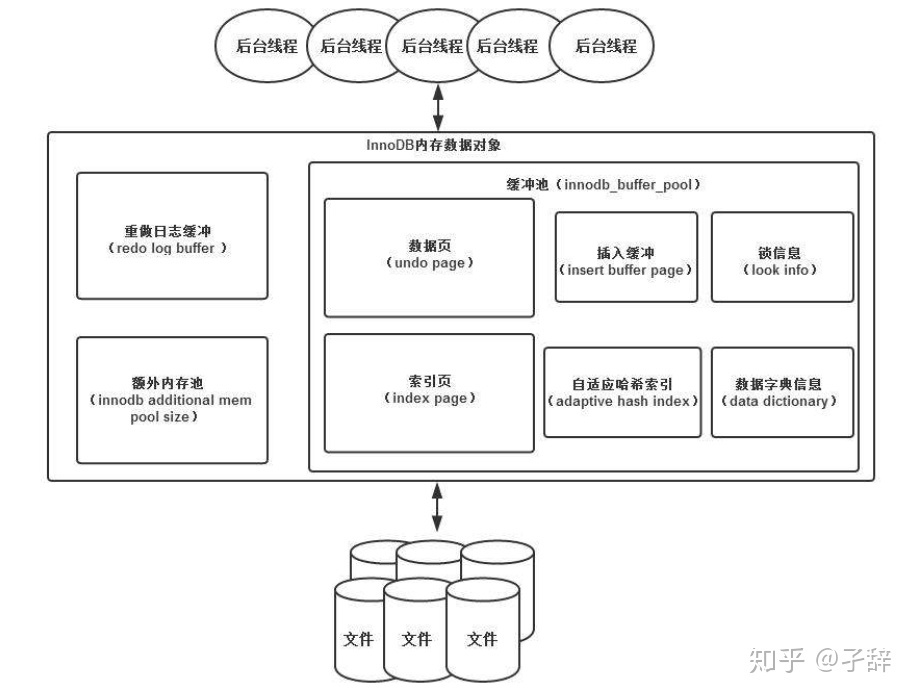
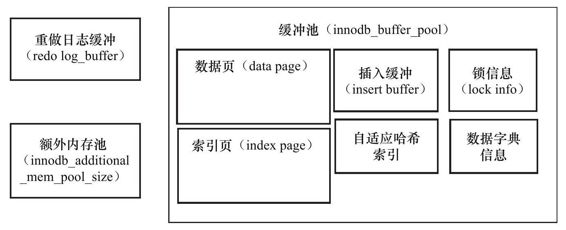
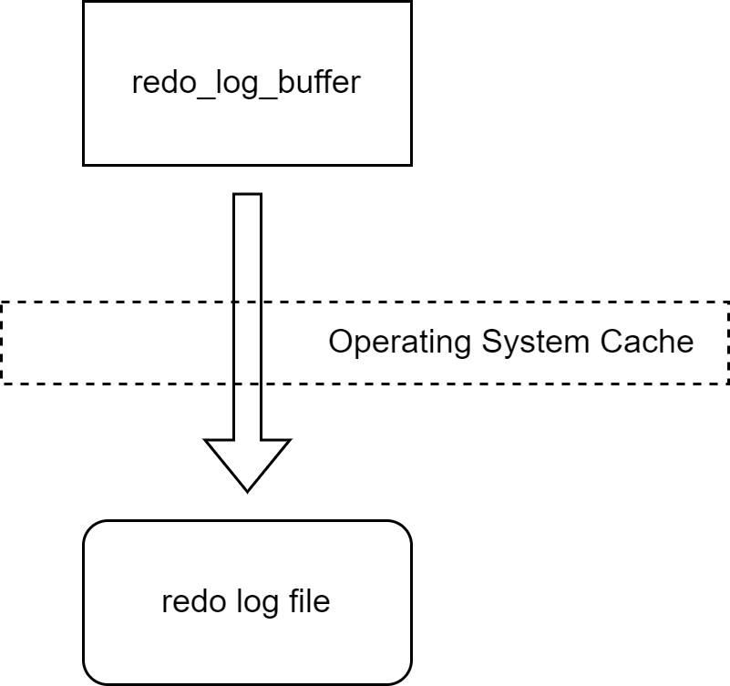
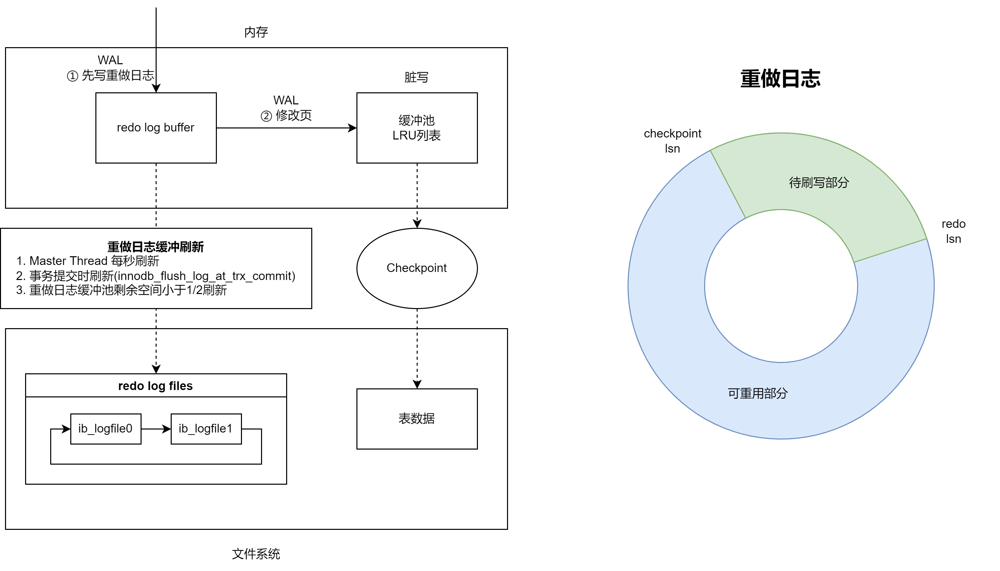
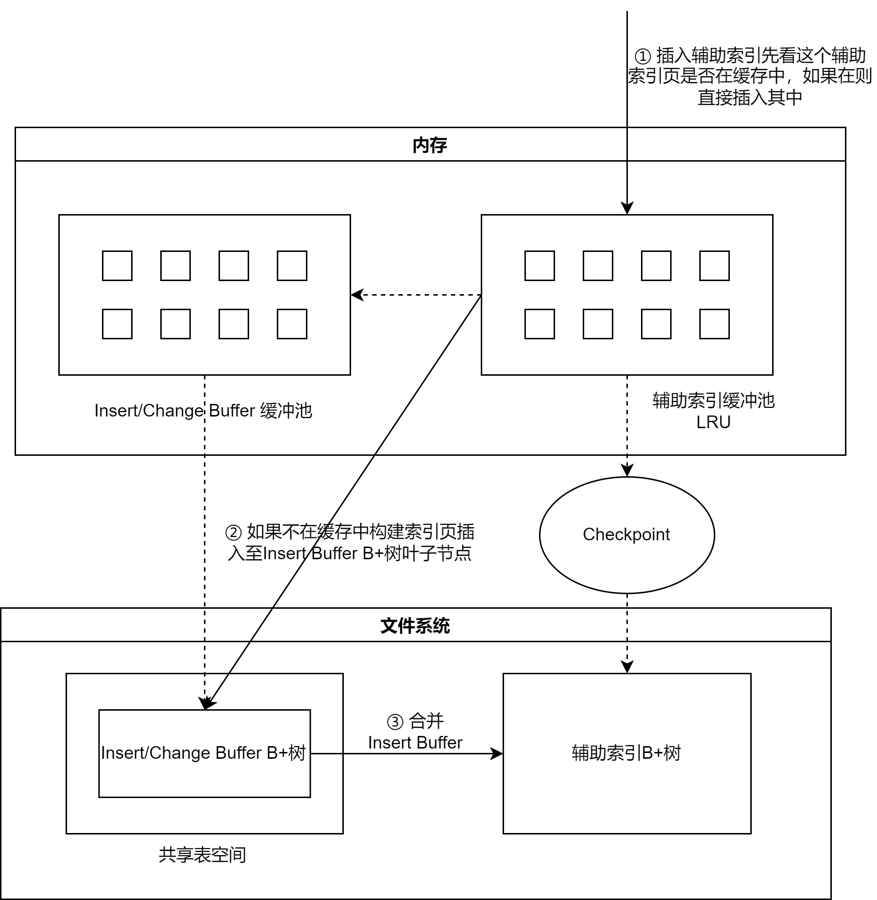
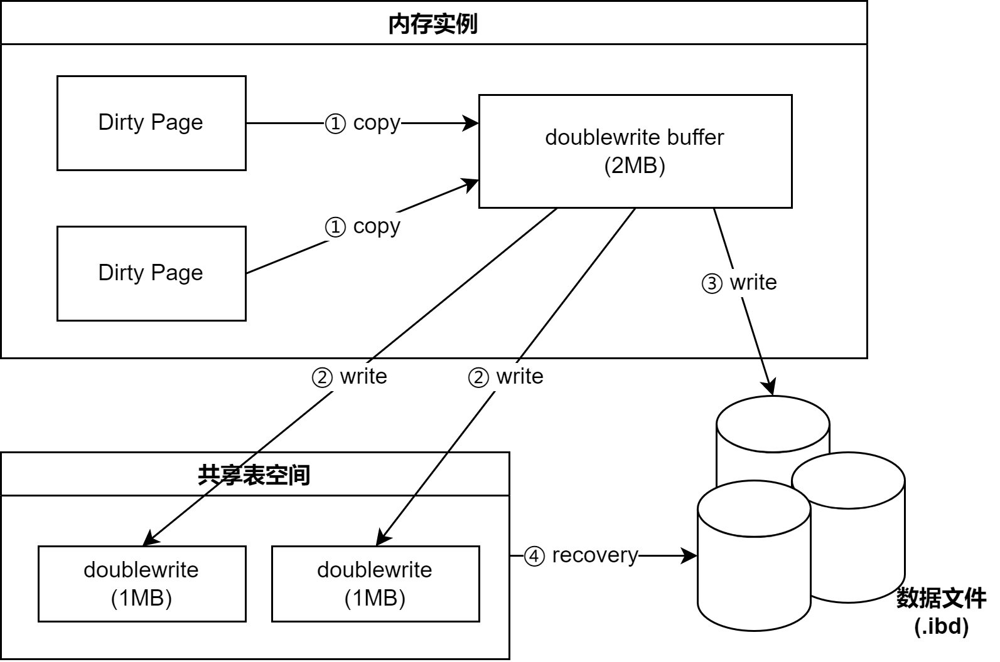

# 体系结构和存储引擎

## Tips

mysql 配置文件：

```bash
# 后面的配置文件优先级更高
$ mysql --help | grep my.conf
/etc/my.cnf /etc/mysql/my.cnf ~/.my.cnf
```

数据库存储路径，配置文件中的 datadir 来设置。

## MySQL 体系架构

MySQL 体系结构参考：[MySQL体系架构简介](https://cxis.me/2018/04/07/MySQL%E4%BD%93%E7%B3%BB%E6%9E%B6%E6%9E%84%E7%AE%80%E4%BB%8B/)

## InnoDB

第一个完整支持ACID事务的MySQL存储引擎，支持行锁设计、支持MVCC、支持外键、提供一致性非锁定读。并且在1.2.x版本增加了全文索引支持。

### InnoDB 体系架构



内存池功能：

- 维护所有进程/线程需要访问的多个内部数据结构。
- 缓存磁盘上的数据，方便快速地读取，同时在对磁盘文件的数据修改之前在这里缓存。
- 重做日志（redo log）缓冲。
- ...

后台线程功能：

- 刷新内存池中的数据，保证缓冲池中的内存缓存的是最近的数据
- 已修改的数据文件刷新到磁盘文件
- 保证在数据库发生异常的情况下InnoDB能恢复到正常运行状态

### 后台线程

1. Master Thread

    Master Thread是一个非常核心的后台线程。主要负责将缓冲池中的数据异步刷新到磁盘，保证数据的一致性。

    - 脏页的刷新（1.2.x 迁移至 Page Cleaner Thread）
    - 合并插入缓冲（INSERT BUFFER）
    - UNDO页的回收等。

2. IO Thread

    在InnoDB存储引擎中大量使用了AIO（Async IO）来处理写IO请求，这样可以极大提高数据库的性能。而IO Thread的工作主要是负责这些IO请求的回调（call back）处理。InnoDB 1.0版本之前共有4个IO Thread，分别是write、read、insert buffer和log IO thread。

    ```SQL
    -- 查看 InnoDB 版本
    SHOW VARIABLES LIKE 'innodb_version';
    -- 在 FILE I/O 中查看 IO线程
    SHOW ENGINE INNODB STATUS；
    ```

3. Pruge Thread

    事务被提交后，其所使用的undolog可能不再需要，因此需要PurgeThread来回收已经使用并分配的undo页。在InnoDB 1.1版本之前，purge操作仅在InnoDB存储引擎的Master Thread中完成。用户可以在MySQL数据库的配置文件中添加如下命令来启用独立的Purge Thread：

    ```cnf
    [mysqld]
    innodb_purge_threads=1
    ```

    而从InnoDB 1.1版本开始，purge操作可以独立到单独的线程中进行，以此来减轻Master Thread的工作，从而提高CPU的使用率以及提升存储引擎的性能。但是在1.1版本只能设置一个。

    从InnoDB 1.2版本开始，InnoDB支持多个Purge Thread，这样做的目的是为了进一步加快undo页的回收。

    ```sql
    -- 查看剪枝线程
    SHOW VARIABLES LIKE'innodb_purge_threads';
    ```

4. Page Cleaner Thread

    Page Cleaner Thread是在InnoDB 1.2.x版本中引入的。其作用是将之前版本中脏页的刷新操作都放入到单独的线程中来完成。而其目的是为了减轻原Master Thread的工作及对于用户查询线程的阻塞，进一步提高InnoDB存储引擎的性能。

### 内存

#### 缓冲池

InnoDB存储引擎是基于磁盘存储的，并将其中的记录按照**页**的方式进行管理。因此可将其视为基于磁盘的数据库系统（Disk-base Database）。在数据库系统中，由于CPU速度与磁盘速度之间的鸿沟，基于磁盘的数据库系统通常使用缓冲池技术来提高数据库的整体性能。缓冲池简单来说就是一块内存区域，通过内存的速度来弥补磁盘速度较慢对数据库性能的影响。

- 在数据库中进行读取页的操作，首先将从磁盘读到的页存放在缓冲池中，这个过程称为将页“FIX”在缓冲池中。下一次再读相同的页时，首先判断该页是否在缓冲池中。若在缓冲池中，称该页在缓冲池中被命中，直接读取该页。否则，读取磁盘上的页。
- 对于数据库中页的修改操作，则首先修改在缓冲池中的页，然后再以一定的频率刷新到磁盘上。这里需要注意的是，页从缓冲池刷新回磁盘的操作并不是在每次页发生更新时触发，而是通过一种称为Checkpoint的机制刷新回磁盘。同样，这也是为了提高数据库的整体性能。

对于InnoDB存储引擎而言，其缓冲池的配置通过参数innodb_buffer_pool_size来设置。
通过`SHOW VARIABLES LIKE'innodb_buffer_pool_size'`查看当前MySQL实例的MySQL缓冲池大小。

具体来看，缓冲池中缓存的数据页类型有：索引页、数据页、undo页、插入缓冲（insert buffer）、自适应哈希索引（adaptive hash index）、InnoDB存储的锁信息（lock info）、数据字典信息（data dictionary）等。不能简单地认为，缓冲池只是缓存索引页和数据页，它们只是占缓冲池很大的一部分而已。图2-2很好地显示了InnoDB存储引擎中内存的结构情况。



从InnoDB 1.0.x版本开始，允许有多个缓冲池实例。每个页根据哈希值平均分配到不同缓冲池实例中。这样做的好处是减少数据库内部的资源竞争，增加数据库的并发处理能力。可以通过参数innodb_buffer_pool_instances来进行配置，该值默认为1。

通过命令`SHOW ENGINE INNODB STATUS`可以观察到每个缓冲池实例对象运行的状态，并且通过类似---BUFFER POOL 0的注释来表明是哪个缓冲池实例。

从MySQL 5.6版本开始，还可以通过`information_schema`架构（库）下的表`INNODB_BUFFER_POOL_STATS`来观察缓冲的状态。

#### LRU List、Free List 和 Flush List


LRU列表

数据库中的缓冲池是通过LRU（Latest Recent Used，最近最少使用）算法来进行管理的。即最频繁使用的页在LRU列表的前端，而最少使用的页在LRU列表的尾端。当缓冲池不能存放新读取到的页时，将首先释放LRU列表中尾端的页。

稍有不同的是InnoDB存储引擎对传统的LRU算法做了一些优化。在InnoDB的存储引擎中，LRU列表中还加入了midpoint位置。新读取到的页，虽然是最新访问的页，但并不是直接放入到LRU列表的首部，而是放入到LRU列表的midpoint位置。这个算法在InnoDB存储引擎下称为midpoint insertion strategy。在默认配置下，该位置在LRU列表长度的5/8处。

那为什么不采用朴素的LRU算法，直接将读取的页放入到LRU列表的首部呢？这是因为若直接将读取到的页放入到LRU的首部，那么某些SQL操作可能会使缓冲池中的页被刷新出，从而影响缓冲池的效率。常见的这类操作为索引或数据的扫描操作。这类操作需要访问表中的许多页，甚至是全部的页，而这些页通常来说又仅在这次查询操作中需要，并不是活跃的热点数据。如果页被放入LRU列表的首部，那么非常可能将所需要的热点数据页从LRU列表中移除，而在下一次需要读取该页时，InnoDB存储引擎需要再次访问磁盘。

InnoDB存储引擎引入了另一个参数来进一步管理LRU列表，这个参数是innodb_old_blocks_time，用于表示页读取到mid位置后需要等待多久才会被加入到LRU列表的热端。因此当需要执行上述所说的SQL操作时，可以通过下面的方法尽可能使LRU列表中热点数据不被刷出。

unzip_LRU列表

InnoDB存储引擎从1.0.x版本开始支持压缩页的功能，即将原本16KB的页压缩为1KB、2KB、4KB和8KB。而由于页的大小发生了变化，LRU列表也有了些许的改变。对于非16KB的页，是通过unzip_LRU列表进行管理的。

对于压缩页的表，每个表的压缩比率可能各不相同。可能存在有的表页大小为8KB，有的表页大小为2KB的情况。unzip_LRU是怎样从缓冲池中分配内存的呢？

首先，在unzip_LRU列表中对不同压缩页大小的页进行分别管理。其次，通过伙伴算法进行内存的分配。例如对需要从缓冲池中申请页为4KB的大小，其过程如下：

1. 检查4KB的unzip_LRU列表，检查是否有可用的空闲页；
2. 若有，则直接使用；
3. 否则，检查8KB的unzip_LRU列表；
4. 若能够得到空闲页，将页分成2个4KB页，存放到4KB的unzip_LRU列表；
5. 若不能得到空闲页，从LRU列表中申请一个16KB的页，将页分为1个8KB的页、2个4KB的页，分别存放到对应的unzip_LRU列表中。

Free列表

LRU列表用来管理已经读取的页，但当数据库刚启动时，LRU列表是空的，即没有任何的页。这时页都存放在Free列表中。当需要从缓冲池中分页时，首先从Free列表中查找是否有可用的空闲页，若有则将该页从Free列表中删除，放入到LRU列表中。否则，根据LRU算法，淘汰LRU列表末尾的页，将该内存空间分配给新的页。

Flush列表

在LRU列表中的页被修改后，称该页为脏页（dirty page），即缓冲池中的页和磁盘上的页的数据产生了不一致。这时数据库会通过CHECKPOINT机制将脏页刷新回磁盘，而Flush列表中的页即为脏页列表。需要注意的是，脏页既存在于LRU列表中，也存在于Flush列表中。LRU列表用来管理缓冲池中页的可用性，Flush列表用来管理将页刷新回磁盘，二者互不影响。

#### 重做日志缓冲



InnoDB存储引擎的内存区域除了有缓冲池外，还有重做日志缓冲（redo log buffer）。InnoDB存储引擎首先将重做日志信息先放入到这个缓冲区，然后按一定频率将其刷新到重做日志文件。重做日志缓冲一般不需要设置得很大，因为一般情况下每一秒钟会将重做日志缓冲刷新到日志文件，因此用户只需要保证每秒产生的事务量在这个缓冲大小之内即可。该值可由配置参数innodb_log_buffer_size控制，默认为8MB。

在通常情况下，8MB的重做日志缓冲池足以满足绝大部分的应用，因为重做日志在下列三种情况下会将重做日志缓冲中的内容刷新到外部磁盘的重做日志文件中。

- Master Thread每一秒将重做日志缓冲刷新到重做日志文件；
- 每个事务提交时会将重做日志缓冲刷新到重做日志文件；
- 当重做日志缓冲池剩余空间小于1/2时，重做日志缓冲刷新到重做日志文件。

#### 额外的内存池

在InnoDB存储引擎中，对内存的管理是通过一种称为内存堆（heap）的方式进行的。在对一些**数据结构本身的内存**进行分配时，需要从额外的内存池中进行申请，当该区域的内存不够时，会从缓冲池中进行申请。例如，分配了缓冲池（innodb_buffer_pool），但是每个**缓冲池中的帧缓冲（frame buffer）**还有对应的**缓冲控制对象（buffer control block）**，这些对象记录了一些诸如LRU、锁、等待等信息，而这个对象的内存需要从额外内存池中申请。因此，在申请了很大的InnoDB缓冲池时，也应考虑相应地增加这个值。

### Checkpoint 技术（缩短恢复时间，脏页刷新)

缓冲池的设计目的为了协调CPU速度与磁盘速度的鸿沟。因此页的操作首先都是在缓冲池中完成的。如果一条DML语句，如Update或Delete改变了页中的记录，那么此时页是脏的，即缓冲池中的页的版本要比磁盘的新。数据库需要将新版本的页从缓冲池刷新到磁盘。

倘若每次一个页发生变化，就将新页的版本刷新到磁盘，那么这个开销是非常大的。若热点数据集中在某几个页中，那么数据库的性能将变得非常差。同时，如果在从缓冲池将页的新版本刷新到磁盘时发生了宕机，那么数据就不能恢复了。为了避免发生数据丢失的问题，当前事务数据库系统普遍都采用了**Write Ahead Log策略**，即当事务提交时，先写重做日志，再修改页。当由于发生宕机而导致数据丢失时，通过重做日志来完成数据的恢复。这也是事务ACID中D（Durability持久性）的要求。**因此对重做日志的WAL机制是保证持久性的。**



如果重做日志可以无限地增大，同时缓冲池也足够大，能够缓冲所有数据库的数据，那么是不需要将缓冲池中页的新版本刷新回磁盘。因为当发生宕机时，完全可以通过重做日志来恢复整个数据库系统中的数据到宕机发生的时刻。但是这需要两个前提条件：

1. 缓冲池可以缓存数据库中所有的数据；
2. 重做日志可以无限增大。

**内存资源宝贵**，因此第一个假设对于生产环境应用中的数据库是很难得到保证的。

重做日志可以无限增大。也许是可以的，但是这对**成本的要求太高**，同时**不便于运维**。因为DBA或SA不能知道什么时候重做日志是否已经接近于磁盘可使用空间的阈值，并且要让存储设备支持可动态扩展也是需要一定的技巧和设备支持的。

即使上述两个条件都满足，那么还有一个情况需要考虑：宕机后数据库的恢复时间。当数据库运行了几个月甚至几年时，这时发生宕机，重新应用重做日志的时间会非常久，此时**恢复的代价极大**。

Checkpoint（检查点）技术的目的是解决以下几个问题：

- 缩短数据库的恢复时间；
- 缓冲池不够用时，将脏页刷新到磁盘；
- 重做日志不可用时，刷新脏页。

当数据库发生宕机时，数据库不需要重做所有的日志，因为Checkpoint之前的页都已经刷新回磁盘。故数据库只需对Checkpoint后的重做日志进行恢复。这样就大大**缩短了恢复的时间**。

当**缓冲池**不够用时，根据LRU算法会溢出最近最少使用的页，若此页为脏页，那么需要强制执行Checkpoint，将脏页也就是页的新版本刷回磁盘。

重做日志出现不可用（不够用）的情况是因为当前事务数据库系统对重做日志的设计都是循环使用的，并不是让其无限增大的，这从成本及管理上都是比较困难的。重做日志可以被重用的部分是指这些重做日志已经不再需要，即当数据库发生宕机时，数据库恢复操作不需要这部分的重做日志，因此这部分就可以被覆盖重用。若此时重做日志还需要使用，那么必须强制产生Checkpoint，将缓冲池中的页至少刷新到当前重做日志的位置。

在InnoDB存储引擎中，Checkpoint发生的时间、条件及脏页的选择等都非常复杂。而Checkpoint所做的事情无外乎是将缓冲池中的脏页刷回到磁盘。不同之处在于每次刷新多少页到磁盘，每次从哪里取脏页，以及什么时间触发Checkpoint。在InnoDB存储引擎内部，有两种Checkpoint：

- Sharp Checkpoint
- Fuzzy Checkpoint

Sharp Checkpoint发生在数据库关闭时将所有的脏页都刷新回磁盘，这是默认的工作方式，即参数innodb_fast_shutdown=1。但是若数据库在运行时也使用Sharp Checkpoint，那么数据库的可用性就会受到很大的影响。故在InnoDB存储引擎内部使用Fuzzy Checkpoint进行页的刷新，即只刷新一部分脏页，而不是刷新所有的脏页回磁盘。

### Insert Buffer（提高非聚集不唯一索引的插入效率）



在InnoDB存储引擎中，主键是行唯一的标识符。通常应用程序中行记录的插入顺序是按照主键递增的顺序进行插入的。因此，插入聚集索引（Primary Key）一般是顺序的，不需要磁盘的随机读取。注意　并不是所有的主键插入都是顺序的。若主键类是UUID这样的类，那么插入和辅助索引一样，同样是随机的。即使主键是自增类型，但是插入的是指定的值，而不是NULL值，那么同样可能导致插入并非连续的情况。(自增且插入NULL时顺序插入的，无需随机读取)

但是对于非聚集不唯一的索引叶子节点的插入不再是顺序的了。这时每次索引的插入都需要离散地访问非聚集索引页，由于随机读取的存在而导致了插入操作性能下降。这是因为B+树的特性决定了非聚集索引插入的离散性。

1. InnoDB存储引擎开创性地设计了Insert Buffer，对于非聚集索引的插入或更新操作，不是每一次直接插入到索引页中，而是先判断插入的非聚集索引页是否在缓冲池中，若在，则直接插入；
2. 若不在，则先放入到一个Insert Buffer对象中（插入快），好似欺骗。数据库这个非聚集的索引已经插到叶子节点，而实际并没有，只是存放在另一个位置。
3. 然后再以一定的频率和情况进行Insert Buffer和辅助索引页子节点的merge（合并）操作，这时通常能将多个插入合并到一个操作中（因为在一个索引页中），这就大大提高了对于非聚集索引插入的性能。

然而Insert Buffer的使用需要同时满足以下两个条件：

- 索引是**辅助索引（secondary index）**；
- 索引**不是唯一（unique）**的。

辅助索引不能是**唯一**的，因为在插入缓冲时，数据库并不去查找索引页来判断插入的记录的唯一性。如果去查找肯定又会有离散读取的情况发生，从而导致Insert Buffer失去了意义。

Insert Buffer是一棵B+树，因此其也由叶节点和非叶节点组成。非叶节点存放的是查询的search key（键值）。search key一共占用9个字节，其中space表示待插入记录所在表的表空间id，在InnoDB存储引擎中，每个表有一个唯一的space id，可以通过space id查询得知是哪张表。space占用4字节。marker占用1字节，它是用来兼容老版本的Insert Buffer。offset表示页所在的偏移量，占用4字节（应该是在每次页满了之后自增的）。Insert Buffer的键是辅助索引的页，它将多个辅助索引的记录放在一起在合并的时候一起插入，加快插入效率。


当一个辅助索引要插入到页（space，offset）时，如果这个页不在缓冲池中，那么InnoDB存储引擎首先根据上述规则构造一个search key，接下来查询Insert Buffer这棵B+树，然后再将这条记录插入到Insert Buffer B+树的叶子节点中。叶子节点结构如下:


因为启用Insert Buffer索引后，辅助索引页（space，page_no）中的记录可能被插入到Insert Buffer B+树中，所以为了保证每次Merge Insert Buffer页必须成功，还需要有一个特殊的页用来标记每个辅助索引页（space，page_no）的可用空间。这个页的类型为Insert Buffer Bitmap。

若需要实现插入记录的辅助索引页不在缓冲池中，那么需要将辅助索引记录首先插入到这棵B+树中。Insert Buffer中的记录在如下情况下合并（merge）到真正的辅助索引中：

- 辅助索引页被读取到缓冲池时；
- Insert Buffer Bitmap页追踪到该辅助索引页已无可用空间时；
- Master Thread。

第一种情况为当辅助索引页被读取到缓冲池中时，例如这在执行正常的SELECT查询操作，这时需要检查Insert Buffer Bitmap页，然后确认该辅助索引页是否有记录存放于Insert Buffer B+树中。若有，则将Insert Buffer B+树中该页的记录插入到该辅助索引页中。可以看到对该页多次的记录操作通过一次操作合并到了原有的辅助索引页中，因此性能会有大幅提高。

Insert Buffer Bitmap页用来追踪每个辅助索引页的可用空间，并至少有1/32页的空间。若插入辅助索引记录时检测到插入记录后可用空间会小于1/32页，则会强制进行一个合并操作，即强制读取辅助索引页，将Insert Buffer B+树中该页的记录及待插入的记录插入到辅助索引页中。这就是上述所说的第二种情况。

还有一种情况，之前在分析Master Thread时曾讲到，在Master Thread线程中每秒或每10秒会进行一次Merge Insert Buffer的操作，不同之处在于每次进行merge操作的页的数量不同。

在Master Thread中，执行merge操作的不止是一个页，而是根据srv_innodb_io_capactiy的百分比来决定真正要合并多少个辅助索引页。但InnoDB存储引擎又是根据怎样的算法来得知需要合并的辅助索引页呢？

在Insert Buffer B+树中，辅助索引页根据（space，offset）都已排序好，故可以根据（space，offset）的排序顺序进行页的选择。然而，对于Insert Buffer页的选择，InnoDB存储引擎并非采用这个方式，它随机地选择Insert Buffer B+树的一个页，读取该页中的space及之后所需要数量的页。该算法在复杂情况下应有更好的公平性。同时，若进行merge时，要进行merge的表已经被删除，此时可以直接丢弃已经被Insert/Change Buffer的数据记录。

### 两次写（提高数据页的可靠性）

如果说Insert Buffer带给InnoDB存储引擎的是性能上的提升，那么doublewrite（两次写）带给InnoDB存储引擎的是数据页的可靠性。

当发生数据库宕机时，可能InnoDB存储引擎正在写入某个页到表中，而这个页只写了一部分，比如16KB的页，只写了前4KB，之后就发生了宕机，这种情况被称为部分写失效（partial page write）。在InnoDB存储引擎未使用doublewrite技术前，曾经出现过因为部分写失效而导致数据丢失的情况。

有经验的DBA也许会想，如果发生写失效，可以通过重做日志进行恢复。这是一个办法。但是必须清楚地认识到，重做日志中记录的是对页的物理操作，如偏移量800，写'aaaa'记录。如果这个页本身已经发生了损坏，再对其进行重做是没有意义的。这就是说，在应用（apply）重做日志前，用户需要一个页的副本，当写入失效发生时，先通过页的副本来还原该页，再进行重做，这就是doublewrite。在InnoDB存储引擎中doublewrite的体系架构如下图所示。



doublewrite由两部分组成，一部分是内存中的doublewrite buffer，大小为2MB，另一部分是物理磁盘上共享表空间中连续的128个页，即2个区（extent），大小同样为2MB。

1. 在对缓冲池的脏页进行刷新时，并不直接写磁盘，而是会通过memcpy函数将脏页先复制到内存中的doublewrite buffer;
2. 之后通过doublewrite buffer再分两次，每次1MB顺序地写入共享表空间的物理磁盘上，然后马上调用fsync函数，同步磁盘，避免缓冲写带来的问题。在这个过程中，因为doublewrite页是连续的，因此这个过程是顺序写的，开销并不是很大。
3. 在完成doublewrite页的写入后，再将doublewrite buffer中的页写入各个表空间文件中，此时的写入则是离散的。
4. 如果操作系统在将页写入磁盘的过程中发生了崩溃，在恢复过程中，InnoDB存储引擎可以从共享表空间中的doublewrite中找到该页的一个副本，将其复制到表空间文件，再应用重做日志。

### 自适应哈希索引（提高热点数据查询效率）

哈希（hash）是一种非常快的查找方法，在一般情况下这种查找的时间复杂度为O(1)，即一般仅需要一次查找就能定位数据。而B+树的查找次数，取决于B+树的高度，在生产环境中，B+树的高度一般为3～4层，故需要3～4次的查询。

InnoDB存储引擎会监控对表上各索引页的查询。如果观察到建立哈希索引可以带来速度提升，则建立哈希索引，称之为自适应哈希索引（Adaptive Hash Index，AHI）。AHI是通过缓冲池的B+树页构造而来，因此建立的速度很快，而且不需要对整张表构建哈希索引。InnoDB存储引擎会自动根据访问的频率和模式来自动地为某些热点页建立哈希索引。

AHI有一个要求，即对这个页的连续访问模式必须是一样的。例如对于（a，b）这样的联合索引页，其访问模式可以是以下情况：

- WHERE a=xxx
- WHERE a=xxx and b=xxx

访问模式一样指的是查询的条件一样，若交替进行上述两种查询，那么InonDB存储引擎不会对该页构造AHI。此外AHI还有如下的要求：

- 以该模式访问了100次
- 页通过该模式访问了N次，其中N=页中记录*1/16

值得注意的是，哈希索引只能用来搜索**等值的查询**，如SELECT*FROM table WHERE index_col='xxx'。而对于其他查找类型，如范围查找，是不能使用哈希索引的。

### 异步IO（提高磁盘操作性能）

IO模型讲解：[100%弄明白5种IO模型](https://zhuanlan.zhihu.com/p/115912936)

为了提高磁盘操作性能，当前的数据库系统都采用异步IO（Asynchronous IO，AIO）的方式来处理磁盘操作。InnoDB存储引擎亦是如此。

与AIO对应的是Sync IO，即每进行一次IO操作，需要等待此次操作结束才能继续接下来的操作。但是如果用户发出的是一条索引扫描的查询，那么这条SQL查询语句可能需要扫描多个索引页，也就是需要进行多次的IO操作。在每扫描一个页并等待其完成后再进行下一次的扫描，这是没有必要的。用户可以在发出一个IO请求后立即再发出另一个IO请求，当全部IO请求发送完毕后，等待所有IO操作的完成，这就是AIO。

AIO的另一个优势是可以进行IO Merge操作，也就是将多个IO合并为1个IO，这样可以提高IOPS的性能。

### 刷新邻接页（提高脏页刷新性能）

InnoDB存储引擎还提供了Flush Neighbor Page（刷新邻接页）的特性。其工作原理为：当刷新一个脏页时，InnoDB存储引擎会检测该页所在区（extent）的所有页，如果是脏页，那么一起进行刷新。这样做的好处显而易见，通过AIO可以将多个IO写入操作合并为一个IO操作，故该工作机制在传统机械磁盘下有着显著的优势。但是需要考虑到下面两个问题：

- 是不是可能将不怎么脏的页进行了写入，而该页之后又会很快变成脏页？
- 固态硬盘有着较高的IOPS，是否还需要这个特性？

为此，InnoDB存储引擎从1.2.x版本开始提供了参数innodb_flush_neighbors，用来控制是否启用该特性。对于传统机械硬盘建议启用该特性，而对于固态硬盘有着超高IOPS性能的磁盘，则建议将该参数设置为0，即关闭此特性。

### 关闭与启动恢复

InnoDB是MySQL数据库的存储引擎之一，因此InnoDB存储引擎的启动和关闭，更准确的是指在MySQL实例的启动过程中对InnoDB存储引擎的处理过程。

在关闭时，参数innodb_fast_shutdown影响着表的存储引擎为InnoDB的行为。该参数可取值为0、1、2，默认值为1。

- 0表示在MySQL数据库关闭时，InnoDB需要完成所有的full purge（和Purge Thread有关用于消除undo log）和merge insert buffer，并且将所有的脏页刷新回磁盘。这需要一些时间，有时甚至需要几个小时来完成。如果在进行InnoDB升级时，必须将这个参数调为0，然后再关闭数据库。
- 1是参数innodb_fast_shutdown的默认值，表示不需要完成上述的full purge（和Purge Thread有关用于消除undo log）和merge insert buffer操作，但是在缓冲池中的一些数据脏页还是会刷新回磁盘。
- 2表示不完成full purge和merge insert buffer操作，也不将缓冲池中的数据脏页写回磁盘，而是将日志都写入日志文件。这样不会有任何事务的丢失，但是下次MySQL数据库启动时，会进行恢复操作（recovery）。

当正常关闭MySQL数据库时，下次的启动应该会非常“正常”。但是如果没有正常地关闭数据库，如用kill命令关闭数据库，在MySQL数据库运行中重启了服务器，或者在关闭数据库时，将参数innodb_fast_shutdown设为了2时，下次MySQL数据库启动时都会对InnoDB存储引擎的表进行恢复操作。

参数innodb_force_recovery影响了整个InnoDB存储引擎恢复的状况。

- 0代表当发生需要恢复时，进行所有的恢复操作，当不能进行有效恢复时，如数据页发生了corruption，MySQL数据库可能发生宕机（crash），并把错误写入错误日志中去。
- 1(SRV_FORCE_IGNORE_CORRUPT)：忽略检查到的corrupt页。
- 2(SRV_FORCE_NO_BACKGROUND)：阻止Master Thread线程的运行，如Master Thread线程需要进行full purge操作，而这会导致crash。
- 3(SRV_FORCE_NO_TRX_UNDO)：不进行事务的回滚操作。
- 4(SRV_FORCE_NO_IBUF_MERGE)：不进行插入缓冲的合并操作。
- 5(SRV_FORCE_NO_UNDO_LOG_SCAN)：不查看撤销日志（Undo Log），InnoDB存储引擎会将未提交的事务视为已提交。
- 6(SRV_FORCE_NO_LOG_REDO)：不进行前滚的操作。

需要注意的是，在设置了参数innodb_force_recovery大于0后，用户可以对表进行select、create和drop操作，但insert、update和delete这类DML操作是不允许的。

最后说一句：

- 事务提交后的持久性（D）保证是redo log
- 事务未提交的一致性（C）保证是undo log
