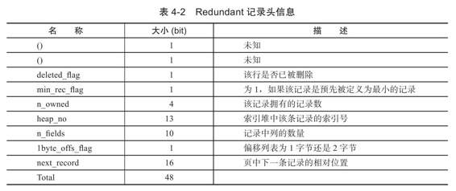

# 表

## 索引组织表

在InnoDB存储引擎中，表都是根据主键顺序组织存放的，这种存储方式的表称为**索引组织表（index organized table）**。

在InnoDB存储引擎表中，每张表都有个**主键（Primary Key）**，如果在创建表时没有显式地定义主键，则InnoDB存储引擎会按如下方式选择或创建主键：

- 首先判断表中是否有**非空唯一索引（Unique NOT NULL）**，如果有，则该列即为主键。
- 如果不符合上述条件，InnoDB存储引擎自动创建一个6字节大小的指针（）。

当表中有多个非空唯一索引时，InnoDB存储引擎将选择建表时第一个定义的非空唯一索引为主键。主键的选择根据的是**定义索引的顺序**，而不是建表时列的顺序。

## InnoDB逻辑存储结构

从InnoDB存储引擎的逻辑存储结构看，所有数据都被*逻辑地*存放在一个空间中，称之为**表空间（tablespace）**。表空间又由**段（segment）**、**区（extent）**、**页（page）**组成。


### 表空间（Tablespace）

表空间可以看做是InnoDB存储引擎逻辑结构的最高层，所有的数据都存放在表空间中。

- 在默认情况下InnoDB存储引擎有一个**共享表空间**ibdata1，即所有数据都存放在这个表空间内
    - 通过 `innodb_data_file_path` 参数对共享表空间的文件进行配置
- 如果用户启用了参数`innodb_file_per_table`，则每张表内的数据可以单独放到一个**独立表空间**内。
    - 独立表空间的命名规则：`表名.idb`

如果启用了innodb_file_per_table的参数，需要注意的是*每张表的独立表空间内存放的只是数据、索引和插入缓冲Bitmap页*，*其他类的数据，如回滚（undo）信息，插入缓冲索引页、系统事务信息，二次写缓冲（Double write buffer）等还是存放在原来的共享表空间内*。

### 段（Segment）

表空间是由各个段组成的，常见的段有**数据段**、**索引段**、**回滚段**等。

- 数据段即为B+树的**叶子节点（Leaf node segment）**
- 索引段即为B+树的**非索引节点（Non-leaf node segment）**

### 区（Extent）

区是由连续页组成的空间，在任何情况下每个区的大小都为**1MB**。

在默认情况下，InnoDB存储引擎页的大小为**16KB**，即一个区中一共有**64个**连续的页（16KB * 64 = 1MB)。

- InnoDB 1.0.x版本开始引入压缩页，即每个压缩页的大小可以通过参数`KEY_BLOCK_SIZE`设置为2K、4K、8K，因此每个区对应页的数量就应该为512、256、128。
    - 在创建表的时候指定 `KEY_BLOCK_SIZE` 参数设置压缩页大小
- InnoDB 1.2.x版本新增了参数`innodb_page_size`，通过该参数可以将默认页的大小设置为4K、8K，区中页的数量同样也为256、128。

**不论页的大小怎么变化，区的大小总是为1M。**

但是，在用户启用了参数`innodb_file_per_talbe`后，创建的表默认大小是96KB（MySQL 8中是112KB）。但问题是每个独立表空间中会包含数据段、索引段等信息，每个段中的每个区的大小总是1MB，那么表空间是不会小于1MB的才对。

原因是因为在每个段开始时，先用32个页大小的**碎片页（fragment page）**来存放数据，在使用完这些碎片页之后，新的页才会采用区的方式（64个连续页）进行空间的申请。这样做的目的是，对于一些小表，或者是undo这类的段，可以在开始时申请较少的空间，节省磁盘容量的开销。

### 页（Page）

**InnoDB页（也可以称为块）是InnoDB磁盘管理的最小单位。**

在InnoDB存储引擎中，默认每个页的大小为16KB。而从InnoDB 1.2.x版本开始，可以通过参数`innodb_page_size`将页的大小设置为4K、8K、16K。若设置完成，则所有表中页的大小都为`innodb_page_size`，不可以对其再次进行修改。除非通过`mysqldump`导入和导出操作来产生新的库。

在InnoDB存储引擎中，常见的页类型有：

- 数据页（B-tree Node）
- undo页（undo Log Page）
- 系统页（System Page）
- 事务数据页（Transaction system Page）
- 插入缓冲位图页（Insert Buffer Bitmap）
- 插入缓冲空闲列表页（Insert Buffer Free List）
- 未压缩的二进制大对象页（Uncompressed BLOB Page）
- 压缩的二进制大对象页（compressed BLOB Page）

### 行（Row）

InnoDB存储引擎是面向行的（row-oriented），也就说数据是按行进行存放的。每个页存放的行记录也是有硬性定义的，最多允许存放 `2^16/2-200` 行的记录，即7992行记录。

## InnoDB行记录格式

参考：[MySQL系列（3）— InnoDB行记录格式](https://juejin.cn/post/6970934163973079048)

InnoDB支持4中行记录格式，分别是`Compact`、`Redundant`、`Dynamic`和`Compressed`行格式。

通过命令`SHOW TABLE STATUS LIKE'table_name'`来查看当前表使用的行格式，其中`row_format`属性表示当前所使用的行记录结构类型。

### Compact行记录格式


**变长字段长度列表**

MySQL中有一些变长字段类型，如 `VARCHAR(M)`、`TEXT`、`BLOB` 等，变长字段的长度是不固定的，所以在存储数据的时候要把这些数据占用的字节数也存起来，读取数据的时候才能根据这个长度列表去读取对应长度的数据。

变长字段长度列表 就是用来记录一行中所有变长字段的真实数据所占用的字节长度，并且各变长字段数据占用的字节数是按照列的顺序**逆序存放**。

变长字段长度列表中只存储值为**非NULL**的列内容占用的长度，值为 NULL 的列的长度是不储存的。如果表中所有的列都不是变长的数据类型的话，就不需要变长字段长度列表了。

若变长字段的长度小于 255字节，就用1字节表示；若大于 255字节，用2字节表示，最大不会不超过2字节，因为MySQL中VARCHAR类型的最大字节长度限制为65535。

对于一些占用字节数非常多的字段，比方说某个字段长度大于了16KB，那么如果该记录在单个页面中无法存储时，InnoDB会把一部分数据存放到所谓的**溢出页**中，在变长字段长度列表处只存储留在本页面中的长度，所以使用两个字节也可以存放下来。


**NULL标志位**

表中的某些列可能会存储NULL值，如果把这些NULL值都放到记录的真实数据中会比较浪费空间，所以Compact行格式把这些值为NULL的列存储到NULL值列表中。

- 如果表中所有列都不允许为 NULL，就不存在NULL值列表了。
- 如果存在允许NULL值的列，则每个列对应一个二进制位，二进制位按照列的顺序逆序排列。
    - 二进制位的值为1时，代表该列的值为NULL。
    - 二进制位的值为0时，代表该列的值不为NULL。

另外，NULL值列表必须用整数个字节的位表示（1字节8位），如果使用的二进制位个数不足整数个字节，则在字节的高位补0。


**记录头信息**

记录头信息是由固定的5个字节组成，5个字节也就是40个二进制位。


**列数据**

最后的部分就是实际存储每个列的数据。注意 NULL 不占该部分任何空间，即 NULL 除了占有NULL值列表的标志位，实际存储不占有任何空间。

每行数据除了用户定义的列外，在开头还有两个隐藏列，**事务ID列（DB_TRX_ID）**和**回滚指针列（DB_ROLL_PTR）**，分别为6字节和7字节的大小。若InnoDB表没有定义主键，每行还会增加一个6字节的**行ID列（DB_ROW_ID）**。

### Redundant行记录格式

Redundant是MySQL 5.0版本之前InnoDB的行记录存储方式，MySQL 5.0支持Redundant是为了兼容之前版本的页格式。


**字段长度偏移列表**

Redundant 行记录格式的首部是一个字段长度偏移列表，同样是按照列的顺序逆序放置的。该条记录中所有列（包括隐藏列、NULL值列）的长度信息都按照逆序存储到字段长度偏移列表。
多了个偏移两个字，也就是列表存储的是每个字段的偏移量，那他就是采用两个相邻数值的差值来计算各个列值的长度。
Redundant 并没有NULL值列表，它是将字段长度偏移列表中的各个列对应的偏移量的第一个比特位作为是否为NULL的依据，该比特位也可以被称之为NULL比特位。也就是说在解析一条记录的某个列时，首先看一下该列对应的偏移量的NULL比特位是不是为1，如果为1，那么该列的值就是NULL，否则不是NULL。

**记录头信息**

Redundant 行格式的记录头信息占用6字节，48个二进制位。

每个位的含义如下表所示：



与 Compact 格式相比，多了 `n_fields`、`1byte_offs_flag` 两个属性，少了 `record_type` 属性。`n_fields` 值代表一行中列的数量，占用10位，这也说明了 Redundant 行格式一行最多支持1023列。`1byte_offs_flags` 值表示偏移列表占用1字节还是2字节。

**列数据**

最后的部分和Compact行记录格式一样都是列数据。

### 字符集

可以通过 `SHOW CHARSET;` 命令查看 MySQL 支持的字符集。几个常用的字符集如下：

```
+----------+---------------------------------+---------------------+--------+
| Charset  | Description                     | Default collation   | Maxlen |
+----------+---------------------------------+---------------------+--------+
| latin1   | cp1252 West European            | latin1_swedish_ci   |      1 |
| ascii    | US ASCII                        | ascii_general_ci    |      1 |
| gb2312   | GB2312 Simplified Chinese       | gb2312_chinese_ci   |      2 |
| gbk      | GBK Simplified Chinese          | gbk_chinese_ci      |      2 |
| utf8     | UTF-8 Unicode                   | utf8_general_ci     |      3 |
| utf8mb4  | UTF-8 Unicode                   | utf8mb4_general_ci  |      4 |
+----------+---------------------------------+---------------------+--------+
```

`latin1 `一个字符最大占用 1字节，`utf8mb4` 一个字符最大占用 4字节。

### VARCHAR 数据类型

创建使用**latin1字符集**和**Compact列格式**创建下表。

```sql
CREATE TABLE `test` (
  `id` BIGINT NOT NULL AUTO_INCREMENT,
  `text` VARCHAR(N) DEFAULT NULL,
  PRIMARY KEY (`ID`)
) ENGINE=InnoDB DEFAULT CHARSET=latin1 ROW_FORMAT=COMPACT;
```

指定 `text` 列为 `VARCHAR(N)`，其中`VARCHAR(N)`中的`N`表示字符长度，`latin1`字符集的1个字符占用1个字节。若指定`N`为VARCHAR能够支持的最大字符数65535时，表创建语句输出异常。

```
Error Code: 1118. Row size too large. The maximum row size for the used table type, not counting BLOBs, is 65535. This includes storage overhead, check the manual. You have to change some columns to TEXT or BLOBs
```

从创建报错的信息可以了解到，**一行数据**除了 `TEXT`、`BLOBs` 这种大对象类型之外，其他所有的列（不包括*隐藏列*和*记录头信息*）占用的字节长度加起来不能超过65535个字节，否则需要将一些过长的列转为 `TEXT` 或 `BLOBs` 类型。

我们预测一下，`text`这个`VARCHAR(N)`的字符数`N`最大能设置多大？从Compact

行格式可以知道，主要有如下几部分的数据：

- **变长字段长度列表**：`text`列超过255字节，需要**2字节**表示长度
- **NULL值列表**：`text`列可为空，所以需要**1字节**标识`text`列的值是否为空
- **id列**：`id`列为`BIGINT`类型，占**8字节**

所以`text`列最多还剩：`65535 - 1 - 2 - 8 = 65524`。

接着将字符集换成 `utf8mb4`，一个字符最多占用**4字节**。这个时候`text`列`VARCHAR(M)`这个`M`设置多大呢？

```sql
CREATE TABLE `test` (
  `id` BIGINT NOT NULL AUTO_INCREMENT,
  `text` VARCHAR(M) DEFAULT NULL,
  PRIMARY KEY (`ID`)
) ENGINE=InnoDB DEFAULT CHARSET=utf8mb4 ROW_FORMAT=COMPACT;
```

要知道`M`指的是**字符长度**，而不是字节长度，而前面在`latin1`字符集且C1可为空的情况下算出的65524表示的既是字符长度又是字节长度。所以这时`text`的能够设置的最大长度应该是`M = 65524 / 4 = 16381`。

### CHAR 数据类型

- 如果是定长字符类型，例如`latin1`，一个字符就是1字节，`CHAR(M)`会用空格补足，不需要在变长字段长度列表记录长度。
- 如果是变长字符类型，例如`utf8mb4`，一个字符占用1-4字节，`CHAR(M)`就会占用`M-4M`字节，会被当成变长字符类型，会将实际长度存储到变长字段长列表中。

### 行溢出数据

MySQL中磁盘和内存交互的基本单位是页，一个页的大小一般是16KB，也就是16384字节，而一个`VARCHAR(M)`类型的列最多可以存储**65532(65535-2，2为变长字段长度列表的大小)字节**，一些大对象如 `TEXT`、`BLOB` 可能存储更多的数据，这时一个页可能就存不了一条记录。这个时候就会发生**行溢出**，多的数据就会存到另外的**溢出页（Uncompress BLOB Page）**中。

InnoDB 规定一页至少存储两条记录（否则失去B+树的意义，变成链表了）。因此如果页中只能存放下一条记录，InnoDB存储引擎会自动将行数据存放到溢出页中。在一般情况下，InnoDB 的数据都是存放在`FIL_PAGE_INDEX(B+树叶子节点)`类型的数据页中的。但是当发生行溢出时，溢出的数据会存放到`FIL_PAGE_TYPE_BLOB(BLOB)`类型的溢出页中。


当发生行溢出时，数据页只保存了前768字节的前缀数据，接着是20个字节的偏移量，指向行溢出页，，大致如下图所示。


### COMPRESSED 和 DYNAMIC 行记录格式

`Compressed`和`Dynamic`行记录格式与`Compact`行记录格式是类似的，只不过在处理行溢出数据时有些区别。

这两种格式采用完全的行溢出方式，数据页不会存储真实数据的前768字节，只存储20个字节的指针来指向溢出页。而实际的数据都存储在溢出页中，看起来就像下面这样：


`Compressed`行记录格式的另一个功能就是，存储在其中的行数据会以`zlib`的算法进行压缩，因此对于`BLOB`、`TEXT`、`VARCHAR`这类大长度类型的数据能够进行非常有效的存储。

## InnoDB数据页结构

详情参考：[MySQL系列（4）— InnoDB数据页结构](https://juejin.cn/post/6974225353371975693)

InnoDB数据页由一下7部分组成：


其中**File Header**、**Page Header**、**File Trailer**的大小是固定的，分别为`38`、`56`、`8`字节，这些空间用来标记该页的一些信息，如Checksum，数据页所在B+树索引的层数等。**User Records**、**Free Space**、**Page Directory**这些部分为实际的行记录存储空间，因此大小是动态的。

### 记录头信息

上一节简单提到了记录头信息，在介绍后面的内容前，再详细看下记录头信息中存储了哪些内容。以Compact记录头信息为例。


行记录看下来就像下面这样：


- `delete_mask`

这个属性标记当前记录是否被删除，值为1的时候表示记录被删除掉了，值为0的时候表示记录没有被删除。

可以看出，当删除一条记录时，只是标记删除，实际在页中还没有被移除。这样做的主要目的是，以后如果有新纪录插入表中，可以复用这些已删除记录的存储空间。

- `min_rec_mask`

B+树的每层非叶子节点中的最小记录都会添加该标记，并设置为1，否则为0。

看下图的索引结构，最底层的叶子节点是存放真实数据的，所以每条记录的 `min_rec_mask` 都为 0。上面两层是非叶子节点，那么每个页中最左边的最小记录的 `min_rec_mask` 就会设置为 1。


- `n_owned`

表示当前记录拥有的记录数，页中的数据其实还会分为多个组，每个组会有一个最大的记录，最大记录的 n_owned 就记录了这个组中的记录数。在后面介绍 Page Directory 时会看到这个属性的用途。

- `heap_no`

这个属性表示当前记录在本页中的位置。

- `record_type`

记录类型：0 表示普通记录，1 表示B+树非叶子节点记录，2 表示最小记录，3 表示最大记录，1xx 表示保留

还是以前面索引结构图来看，上面两层的非叶子节点中的记录 `record_type` 都应该为 1。最底层的叶子节点应该就是普通记录，`record_type` 为 0。其实每个页还会有一个最小记录和最大记录，`record_type` 分别为 2 和 3，这个最小记录和最大记录其实就是后面要说的 Infimum 和 Supremum。

- `next_record`

表示从当前记录的真实数据到下一条记录的真实数据的地址偏移量，如果没有下一条记录就是 0。
数据页中的记录看起来就像下图这样，按主键顺序排列后，`heap_no` 记录了当前记录在本页的位置，然后通过 `next_record` 连接起来。


注意 `next_record` 指向的是记录头与数据之间的位置偏移量。这个位置向左读取就是记录头信息，向右读取就是真实数据，而且之前说过变长字段长度列表和NULL值列表中都是按列逆序存放的，这时往左读取的标识和往右读取的列就对应上了，提高了读取的效率。


### File Header

File Header用来记录页的一些头信息中8个部分组成，共占用38字节。


主要先看下如下的一些信息：

- `FIL_PAGE_SPACE_OR_CHKSUM`

这个代表当前页面的校验和（checksum），每当一个页面在内存中修改了，在同步之前就要把它的校验和算出来。在一个页面被刷到磁盘的时候，首先被写入磁盘的就是这个 checksum。

- `FIL_PAGE_OFFSET`

每一个页都有一个单独的页号，InnoDB 通过页号来唯一定位一个页。
如某独立表空间 a.ibd 的大小为1GB，页的大小默认为16KB，那么总共有65536个页。FIL_PAGE_OFFSET 表示该页在所有页中的位置。若此表空间的ID为10，那么搜索页（10，1）就表示查找表a中的第二个页。

- `FIL_PAGE_PREV` 和 `FIL_PAGE_NEXT`


InnoDB 是以页为单位存放数据的，InnoDB 表是索引组织的表，数据是按主键顺序存放的。数据可能会分散到多个不连续的页中存储，这时就会通过 FIL_PAGE_PREV 和 FIL_PAGE_NEXT 将上一页和下一页连起来，就形成了一个双向链表。这样就通过一个双向链表把许许多多的页就都串联起来了，而无需这些页在物理上真正连着。

- `FIL_PAGE_TYPE`

这个代表当前页的类型，InnoDB 为了不同的目的而设计了许多种不同类型的页。


### Page Header

Page Header 用来记录数据页的状态信息，由14个部分组成，共占用56字节。


.png)

- `PAGE_N_DIR_SLOTS`

页中的记录会按主键顺序分为多个组，每个组会对应到一个槽（Slot），`PAGE_N_DIR_SLOTS`就记录了 Page Directory 中槽的数量。

- `PAGE_HEAP_TOP`

`PAGE_HEAP_TOP` 记录了 Free Space 的地址，这样就可以快速从 Free Space 分配空间到 User Records 了。

- `PAGE_N_HEAP`

本页中的记录的数量，包括最小记录（Infimum）和最大记录（Supremum）以及标记为删除（delete_mask=1）的记录。

- `PAGE_FREE`

已删除的记录会通过 next_record连成一个单链表，这个单链表中的记录空间可以被重新利用，`PAGE_FREE` 指向第一个标记为删除的记录地址，就是单链表的头节点。

- `PAGE_GARBAGE`

标记为已删除的记录占用的总字节数。

- `PAGE_N_RECS`

本页中记录的数量，不包括最小记录和最大记录以及被标记为删除的记录，注意和 `PAGE_N_HEA`P 的区别。

### Infimum 和 Supremum

InnoDB 每个数据页中有两个虚拟的行记录，用来限定记录的边界。**Infimum记录**是比该页中任何主键值都要小的记录，**Supremum记录**是比改页中何主键值都要大的记录。这两个记录在页创建时被建立，并且在任何情况下不会被删除。

并且由于这两条记录不是我们自己定义的记录，所以它们并不存放在页的User Records部分，他们被单独放在一个称为**Infimum + Supremum**的部分。

Infimum 和 Supremum 都是由**5字节**的记录头和**8字节**的一个固定的部分组成，最小记录的固定部分就是单词 `infimum`，最大记录的固定部分就是单词 `supremum`。由于不存在可变长字段或可为空的字段，自然就不存在可变长度字段列表和NULL值列表了。

Infimum和Supremum记录的结构如下图所示。需要注意，Infimum 记录头的 `record_type=2`，表示最小记录；Supremum 记录头的 `record_type=3`，表示最大记录。


加上 Infimum 和 Supremum 记录后，页中的记录看起来就像下图的样子。Infimum 记录头的 `next_record` 指向该页主键最小的记录，该页主键最大的记录的 `next_record` 则指向 Supremum，Infimum 和 Supremum就构成了记录的边界。同时注意，记录头中 `heap_no` 的顺序， Infimum 和 Supremum 是排在最前面的。


### User Records 和 Free Space

**User Records**就是实际存储行记录的部分，**Free Space**明显就是空闲空间。

在一开始生成页的时候，并没有**User Records**这个部分，每当插入一条记录，就会从**Free Space**部分中申请一个记录大小的空间到**User Records**部分，当**Free Space**部分的空间用完之后，这个页也就使用完了。

### Page Directory

首先我们要知道，InnoDB 的数据是索引组织的，B+树索引本身并不能找到具体的一条记录，只能找到该记录所在的页，页是存储数据的最小基本单位。

如下图，如果我们要查找 `ID=32` 的这行数据，通过索引只能定位到第 17 页。


定位到页之后我们可以通过最小记录Infimum的记录头的`next_record`沿着链表一直往后找，就可以找到 ID=32 这条记录了。

但是可以想象，沿着链表顺序查找的性能是很低的。所以，页中的数据其实是分为多个组的，这看起来就形成了一个子目录，通过子目录就能缩小查询的范围，提高查询性能了。

`Page Directory` 翻译过来就是页目录，这部分存放的就是一个个的槽（Slot），页中的记录分为了多个组，槽就存放了每个组中最大的那条记录的相对位置（记录在页中的相对位置，不是偏移量）。这个组有多少条记录，就通过最大记录的记录头中的 `n_owned` 来表示。

对于分组中的记录数是有规定的：Infimum记录 所在的分组只能有 **1** 条记录，Supremum记录 所在的分组中的记录条数只能在 **1-8** 条之间，中间的其它分组中记录数只能在是 **4-8** 条之间。

Page Directory 的生成过程如下：


1. 初始情况下一个数据页里只有Infimum和Supremum两条记录，它们分属于两个组。Page Directory 中就有两个槽，分别指向这两条记录，且这两条记录的 `n_owned` 都等于 1。
2. 之后每插入一条记录，都会从页目录中找到主键值比本记录的主键值大并且差值最小的槽，然后把该槽对应的记录的 `n_owned` 值加1，表示本组内又添加了一条记录，直到该组中的记录数等于8条。
3. 在一个组中的记录数等于8条后再插入一条记录时，会将组中的记录拆分成两个组，一个组中**4条**记录，另一个**5条**记录。这个过程会在页目录中新增一个槽来记录这个新增分组中最大的那条记录的相对位置。
4. 当记录被删除时，对应槽的最大记录的 `n_owned` 会减 1，当 `n_owned` 小于 4 时，各分组就会平衡一下，总之要满足上面的规定。

Page Directory 中槽（Slot）的数量就会记录到 Page Header 中的 `PAGE_N_DIR_SLOTS`。


以看到，页中的数据经过分组后在 Page Directory 中就形成了一个目录槽，每个槽就指向了分组中的最大记录，最大记录的记录头中的 `n_owned` 就记录了这个组中的记录数。

有了目录槽之后，InnoDB就会利用二叉查找迅速确定记录所在的槽，并找到该槽所在分组中主键值最小的那条记录，再通过最小记录的 next_record 遍历记录，就能快速定位到匹配的那条记录了。

二叉查找的时间复杂度很低，同时在内存中的查找很快，因此通常会忽略这部分查找所用的时间。

### File Trailer

前面介绍 File Header 时说过，在将页写入磁盘时，最先写入的便是 File Header 中的 `FIL_PAGE_SPACE_OR_CHKSUM` 值，就是页面的校验和。在写入的过程中，数据库可能发生宕机，导致页没有完整的写入磁盘。

为了校验页是否完整写入磁盘，InnoDB 就设置了 File Trailer 部分。File Trailer 中只有一个`FIL_PAGE_END_LSN`，占用8字节。`FIL_PAGE_END_LSN` 又分为两个部分。前4字节代表页的校验和，后4字节代表页面被最后修改时对应的日志序列位置（LSN）与File Header中的`FIL_PAGE_LSN`相同。

将这两个值与File Header中的`FIL_PAGE_SPACE_OR_CHKSUM`和`FIL_PAGE_LSN`值进行比较，看是否一致（checksum的比较需要通过InnoDB的checksum函数来进行比较，不是简单的等值比较），以此来**保证页的完整性**。

## 约束

### 数据完整性

关系型数据库通过约束（constraint）机制来保证数据库中数据的完整性。

一般来说，数据完整性有以下三种形式：

- **实体完整性**

  **实体完整性保证表中有一个主键**。在InnoDB存储引擎表中，用户可以通过定义*Primary Key*或*Unique Key*约束来保证实体的完整性。用户还可以通过编写一个*触发器*来保证数据完整性。

- **域完整性**

  **域完整性保证数据每列的值满足特定的条件**。在InnoDB存储引擎表中，域完整性可以通过以下几种途径来保证：

  - *选择合适的数据类型确保一个数据值满足特定条件*
  - *外键（Foreign Key）约束*
  - *编写触发器*
  - *还可以考虑用DEFAULT约束作为强制域完整性的一个方面*

- **参考完整性**

  **参照完整性保证两张表之间的关系**。InnoDB存储引擎支持外键，因此允许用户定义*外键*以强制参照完整性，也可以通过编写*触发器*以强制执行。


对于InnoDB存储引擎本身而言，提供了以下几种约束：

- `Primary Key`
- `Unique Key`
- `Foreign Key`
- `Default`
- `NOT NULL`

### 索引与约束

当用户创建了一个唯一索引就创建了一个唯一的约束。但是约束和索引的概念还是有所不同的，约束更是一个逻辑的概念，用来保证数据的完整性，而索引是一个数据结构，既有逻辑上的概念，在数据库中还代表着物理存储的方式。

### 对错误数据的约束

在某些默认设置下，MySQL数据库允许非法的或不正确的数据的插入或更新，又或者可以在数据库内部将其转化为一个合法的值，如向`NOT NULL`的字段插入一个`NULL`值，MySQL数据库会将其更改为0再进行插入，因此数据库本身没有对数据的正确性进行约束。

通过设置参数`sql_mode`的值为`STRICT_TRANS_TABLES`，这次MySQL数据库对于输入值的合法性进行了约束，而且针对不同的错误，提示的错误内容也都不同。

### ENUM和SET约束

对于离散类型的数值约束，MySQL可以通过`ENUM`和`SET`类型可以解决部分这样的约束需求。

### 触发器与约束

触发器的作用是在执行`INSERT`、`DELETE`和`UPDATE`命令之前或之后自动调用SQL命令或存储过程。

创建触发器的命令是`CREATE TRIGGER`，只有具备Super权限的MySQL数据库用户才可以执行这条命令：

```sql
CREATE
    [DEFINER = user]
    TRIGGER [IF NOT EXISTS] trigger_name
    trigger_time trigger_event
    ON tbl_name FOR EACH ROW
    [trigger_order]
    trigger_body

trigger_time: { BEFORE | AFTER }

trigger_event: { INSERT | UPDATE | DELETE }

trigger_order: { FOLLOWS | PRECEDES } other_trigger_name
```

最多可以为一个表建立6个触发器，即分别为`INSERT`、`UPDATE`、`DELETE`的`BEFORE`和`AFTER`各定义一个。`BEFORE`和`AFTER`代表触发器发生的时间，表示是在每行操作的之前发生还是之后发生。

通过触发器，用户可以实现MySQL数据库本身并不支持的一些特性，如**对于传统`CHECK`约束的支持**，**物化视图**、**高级复制**、**审计等特性**。

### 外键约束

外键用来保证参照完整性，MySQL数据库的MyISAM存储引擎本身并不支持外键，对于外键的定义只是起到一个注释的作用。而InnoDB存储引擎则完整支持外键约束。外键的定义如下：

```sql
[CONSTRAINT [symbol]] FOREIGN KEY
    [index_name] (col_name, ...)
    REFERENCES tbl_name (col_name,...)
    [ON DELETE reference_option]
    [ON UPDATE reference_option]

reference_option:
    RESTRICT | CASCADE | SET NULL | NO ACTION | SET DEFAULT
```

用户可以在执行`CREATE TABLE`时就添加外键，也可以在表创建后通过`ALTER TABLE`命令来添加。

一般来说，称被引用的表为**父表**，引用的表称为**子表**。外键定义时的`ON DELETE`和`ON UPDATE`表示在对父表进行`DELETE`和`UPDATE`操作时，对子表所做的操作，可定义的子表操作有：

- `CASCADE`

  `CASCADE`表示当父表发生`DELETE`或`UPDATE`操作时，对相应的子表中的数据也进行`DELETE`或`UPDATE`操作。
- `SET NULL`

  `SET NULL`表示当父表发生`DELETE`或`UPDATE`操作时，相应的子表中的数据被更新为`NULL`值(要注意子表的外键列不能为`NOT NULL`)  
- `NO ACTION`
  `NO ACTION`表示当父表发生`DELETE`或`UPDATE`操作时，抛出错误，不允许这类操作发生。
- `RESTRICT`
  `RESTRICT`表示当父表发生`DELETE`或`UPDATE`操作时，抛出错误，不允许这类操作发生。如果定义外键时没有指定`ON DELETE`或`ON UPDATE`，`RESTRICT`就是默认的外键设置。

从上面的定义可以看出，在MySQL数据库中`NO ACTION`和`RESTRICT`的功能是相同的。

在其他数据库中，如Oracle数据库，有一种称为**延时检查（deferred check）**的外键约束，即检查在SQL语句运行完成后再进行。而目前MySQL数据库的外键约束都是**即时检查（immediate check）**。

在Oracle数据库中，对于建立外键的列，一定不要忘记给这个列加上一个索引。而InnoDB存储引擎在外键建立时会*自动地对该列加一个索引*。因此可以很好地避免外键列上无索引而导致的**死锁**问题的产生。

对于参照完整性约束，外键能起到一个非常好的作用。但是对于数据的导入操作时，外键往往导致在外键约束的检查上**花费大量时间**。因为MySQL数据库的外键是即时检查的，所以对导入的每一行都会进行外键检查。

## 视图

在MySQL数据库中，视图（View）是一个命名的**虚表**，它由一个SQL查询来定义，可以当做表使用。与持久表（permanent table）不同的是，*视图中的数据没有实际的物理存储*。

### 视图的作用

视图的主要用途之一是被用做一个抽象装置，特别是对于一些应用程序，**程序本身不需要关心基表（base table）的结构，只需要按照视图定义来取数据或更新数据**，因此，视图同时在一定程度上起到一个安全层的作用。

虽然视图是基于基表的一个虚拟表，但是用户可以对某些视图进行**更新操作**，其本质就是*通过视图的定义来更新基本表*。一般称可以进行更新操作的视图为**可更新视图（updatable view）**。视图定义中的`WITH CHECK OPTION`就是针对于可更新的视图的，即更新的值是否需要检查。

### 物化视图

Oracle数据库支持**物化视图**——该视图不是基于基表的虚表，而是根据基表实际存在的实表，即**物化视图的数据存储在非易失的存储设备上**。物化视图可以用于预先计算并保存多表的链接（JOIN）或聚集（GROUP BY）等耗时较多的SQL操作结果。这样，在执行复杂查询时，就可以避免进行这些耗时的操作，从而快速得到结果。*物化视图的好处是对于一些复杂的统计类查询能直接查出结果*。

在Oracle数据库中，物化视图的创建方式包括以下两种：

- `BUILD IMMEDIATE`是默认的创建方式，在创建物化视图的时候就生成数据
- `BUILD DEFERRED`在创建物化视图时不生成数据，以后根据需要再生成数据。

**查询重写**是指当对物化视图的基表进行查询时，数据库会自动判断能否通过查询物化视图来直接得到最终的结果，如果可以，则避免了聚集或连接等这类较为复杂的SQL操作，直接从已经计算好的物化视图中得到所需的数据。

**物化视图的刷新**是指当基表发生了DML操作后，物化视图何时采用哪种方式和基表进行同步。刷新的模式有两种：

- `ON DEMAND`意味着物化视图在用户需要的时候进行刷新
- `ON COMMIT`意味着物化视图在对基表的DML操作提交的同时进行刷新

而**刷新的方法**有四种：

- `FAST`：刷新采用增量刷新，只刷新自上次刷新以后进行的修改
- `COMPLETE`：刷新是对整个物化视图进行完全的刷新
- `FORCE`：如果选择`FORCE`方式，则数据库在刷新时会去判断是否可以进行快速刷新，如果可以，则采用`FAST`方式，否则采用`COMPLETE`的方式
- `NEVER`：指物化视图不进行任何刷新

**MySQL数据库本身并不支持物化视图**，换句话说，MySQL数据库中的视图总是虚拟的。但是用户可以通过一些机制来实现物化视图的功能。例如要创建一个`ON DEMAND`的物化视图还是比较简单的，用户只需定时把数据导入到另一张表；而如果要创建一个`ON COMMIT`的物化视图则需要在基表发生INSERT、UPDATE和DELETE操作时创建相应的触发器导入数据。

通过触发器，在MySQL数据库中实现了类似物化视图的功能。但是MySQL数据库本身并不支持物化视图，因此对于物化视图支持的**查询重写（Query Rewrite）功能就显得无能为**力，用户只能在应用程序端做一些控制。