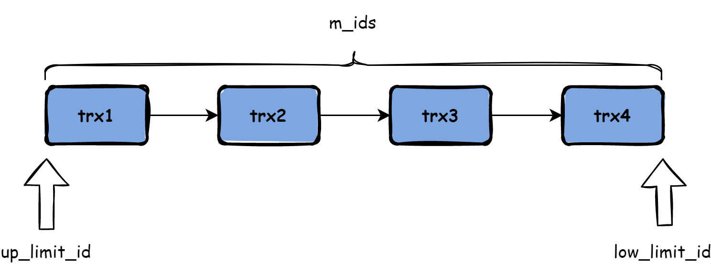

# 锁

## 概念

锁机制用于管理对共享资源的并发访问。数据库系统使用锁是为了支持对共享资源进行并发访问，提供数据的完整性和一致性。

InnoDB存储引擎会在行级别上对**表数据**上锁，也会在**数据库内部**其他多个地方使用锁，从而允许对多种不同资源提供并发访问。例如，操作缓冲池中的LRU列表，删除、添加、移动LRU列表中的元素，为了保证一致性，必须有锁的介入。

## lock 与 latch

在数据库中，lock与latch都可以被称为“锁”。

**latch**一般称为闩锁（轻量级的锁），因为其要求锁定的时间必须非常短。若持续的时间长，则应用的性能会非常差。在InnoDB存储引擎中，latch又可以分为`mutex`（互斥量）和`rwlock`（读写锁）。latch的对象是*线程*，其目的是用来保证并发线程操作*内存*中临界资源的正确性，并且通常*没有死锁检测的机制*。

**lock**的对象是*事务*，用来锁定的是*数据库中的对象*，如表、页、行。并且一般lock的对象仅在事务`commit`或`rollback`后进行释放（不同事务隔离级别释放的时间可能不同）。此外，`lock`同大多数数据库中一样，是*有死锁机制*的。


对于InnoDB存储引擎中的latch，可以通过命令`SHOW ENGINE INNODB MUTEX`来进行查看。

## InnoDB存储引擎中的锁

### 锁的类型

#### 行级锁

InnoDB存储引擎实现了如下两种标准的**行级锁**：

- **共享锁（S Lock）**，允许事务读一行数据。
- **排他锁（X Lock）**，允许事务删除或更新一行数据。


可以发现X锁与任何的锁都不兼容，而S锁仅和S锁兼容。需要特别注意的是，S和X锁都是行锁，兼容是指对同一记录（row）锁的兼容性情况。

#### 意向锁

InnoDB存储引擎支持**多粒度（granular）锁定**，这种锁定允许事务在行级上的锁和表级上的锁同时存在。为了支持在不同粒度上进行加锁操作，InnoDB存储引擎支持一种额外的锁方式，称之为**意向锁（Intention Lock）**。意向锁是将锁定的对象分为多个层次，意向锁意味着事务希望在更细粒度（fine granularity）上进行加锁。

若将上锁的对象看成一棵树，那么对最下层的对象上锁，也就是对最细粒度的对象进行上锁，那么首先需要对粗粒度的对象上锁。例如下图，如果需要对页上的**记录r**进行上X锁，那么分别需要对*数据库A*、*表*、*页*上意向锁IX，最后对**记录r**上X锁。若其中任何一个部分导致等待，那么该操作需要等待粗粒度锁的完成。


InnoDB存储引擎支持意向锁设计比较简练，其意向锁即为**表级别**的锁，而并没有页级别的意向锁。设计目的主要是为了在一个事务中揭示下一行将被请求的锁类型。其支持两种意向锁：

- **意向共享锁（IS Lock）**，事务想要获得一张表中某几行的共享锁
- **意向排他锁（IX Lock）**，事务想要获得一张表中某几行的排他锁

由于InnoDB存储引擎支持的是行级别的锁，因此意向锁其实不会阻塞除全表扫以外的任何请求。故表级意向锁与行级锁的兼容性如下表所示。


**演示**

简单创建一个表`test`,插入一些简单的数据。

```sql
CREATE TABLE `test` (
  `id` int NOT NULL AUTO_INCREMENT,
  `num` int NOT NULL,
  `str` varchar(128) NOT NULL,
  PRIMARY KEY (`id`)
) ENGINE=InnoDB DEFAULT CHARSET=utf8mb4 COLLATE=utf8mb4_0900_ai_ci;

INSERT INTO `test` (`num`, `str`) VALUES ('1', 'foo'), ('1', 'bar'), ('2', 'foobar'), ('3', 'hello world');
```

如果我们直接对`test`表记录进行如下修改，实际上会在在`test`表上添加一个IX意向锁，因为现在`test`表上没有其他锁，所以兼容；之后再在id等于4的列上添加X锁，同样锁兼容，因此修改成功。

```sql
UPDATE `test` SET `num` = '4' WHERE (`id` = '4');
```

但是如果在修改之前先为`test`表添加一个S锁，之后在进行修改。

```sql
-- 为test表添加S锁
LOCK TABLE test READ;
-- 无法修改
UPDATE `test` SET `num` = '4' WHERE (`id` = '4');
```

执行上述SQL会发现无法对记录进行修改，因为在对id为4的记录添加X所之前，会先对`test`表添加IX意向锁。但是在`test`表添加意向锁之前，`test`表上有S锁，因为S锁与IX意向锁不锁兼容，所以无法修改，要等到`test`表S锁解锁后才能够修改。

```sql
-- 表解锁
UNLOCK tables;
-- 修改成功
UPDATE `test` SET `num` = '4' WHERE (`id` = '4');
```

### 锁的信息

> 注：要求MySQL版本大于8.0

`SHOW ENGINE INNODB STATUS`命令来查看当前锁请求的信息：

```
...
------------
TRANSACTIONS
------------
Trx id counter 23026
Purge done for trx's n:o < 23024 undo n:o < 0 state: running but idle
History list length 0
LIST OF TRANSACTIONS FOR EACH SESSION:
---TRANSACTION 421962756665288, not started
0 lock struct(s), heap size 1128, 0 row lock(s)
---TRANSACTION 421962756664480, not started
0 lock struct(s), heap size 1128, 0 row lock(s)
---TRANSACTION 421962756663672, not started
0 lock struct(s), heap size 1128, 0 row lock(s)
---TRANSACTION 421962756662056, not started
0 lock struct(s), heap size 1128, 0 row lock(s)
---TRANSACTION 421962756661248, not started
0 lock struct(s), heap size 1128, 0 row lock(s)
---TRANSACTION 421962756660440, not started
0 lock struct(s), heap size 1128, 0 row lock(s)
---TRANSACTION 421962756659632, not started
0 lock struct(s), heap size 1128, 0 row lock(s)
---TRANSACTION 421962756658824, not started
0 lock struct(s), heap size 1128, 0 row lock(s)
...
```

**事务信息**被存储在`information_schema`架构下的`INNODB_TRX`表中。`INNODB_TRX`表由8个字段组成。


InnoDB的**锁信息**被存储在`performance_schema`架构下的`data_locks`表中，该表有如下字段组成。


在通过表`data_locks`查看了每张表上锁的情况后，用户就可以来判断由此引发的等待情况了。当事务较小时，用户就可以人为地、直观地进行判断了。但是当事务量非常大，其中锁和等待也时常发生，这个时候就不这么容易判断。但是通过`performance_schema`架构下的`data_lock_waits`表，可以很直观地反映当前事务的等待。表`data_lock_waits`由4个字段组成。


### 一致性非锁定读（快照读）

**一致性的非锁定读（consistent nonlocking read）**是指InnoDB存储引擎通过行**多版本控制（multi versioning）**的方式来读取当前执行时间数据库中行的数据。

**MVCC多版本控制**指的是一种提高并发的技术。最早的数据库系统，只有*读读*之间可以并发，*读写*，*写读*，*写写*都要阻塞。引入多版本之后，只有*写写*之间相互阻塞，其他三种操作都可以并行，这样大幅度提高了InnoDB的并发度。

InnoDB的一致性的非锁定读就是通过MVCC实现的，MySQL的大多数事务型存储引擎实现的都不是简单的行级锁。基于提升并发性能的考虑，它们一般都同时实现了多版本并发控制（MVCC）。MVCC的实现，是通过保存数据在某一个时间点的快照来实现的。因此每一个事务无论执行多长时间看到的数据，都是一样的。

MVCC的核心实现主要基于两部分：**多事务并发操作数据**与**一致性读实现**。

#### 多事务并发操作数据

多事务并发操作数据核心基于Undo log进行实现，Undo log可以用来做事务的回滚操作，保证事务的原子性。同时可以用来构建数据修改之前的版本，支持多版本读。

InnoDB中，每一行记录都有两个隐藏列：`DATA_TRX_ID`和`DATA_ROLL_PTR`。(若没有主键，则还有一个`DB_ROW_ID`隐藏主键)

- `DATA_TRX_ID`：记录最近更新这条记录的事务ID(6字节)
- `DATA_ROLL_PTR`：回滚指针，指向Undo Log记录。每次对某条记录进行改动时，该列会存一个指针，可以通过这个指针找到该记录修改前的信息。(7字节)
- `DB_ROW_ID`：行标识（隐藏单增ID），没有主键时主动生成(6字节)

当存在多个事务进行并发操作数据时，不同事务对同一行的更新操作产生多个版本，通过回滚指针`DATA_ROLL_PTR`将这些版本链接成一条**Undo Log链**。

> Undo Log分为`INSERT`和`UPDATE`两种。`DELETE`可以看做是一种特殊的`UPDATE`，即在记录上修改删除标记。
> - `INSERT`：当进行插入数据操作时，会生成`Insert Undo Log`，只在事务回滚时需要, 并且在事务提交后就可以立即丢弃。
> - `UPDATE/DELETE`：事务对记录进行`Delete`和`Update`操作时产生`Undo Log`，并将当前数据记录中的`DB_ROLL_PTR`字段指向它，它不仅在事务回滚时需要，一致性读也需要，所以不能随便删除，只有当数据库所使用的快照中不涉及该日志记录，对应的回滚日志才会被*Purge线程*删除。


更新/删除操作过程：

1. 将待操作的行加排他锁。
2. 将该行原本的值拷贝到Undo Log中，`DB_TRX_ID`和`DB_ROLL_PTR`保持不变。（形成历史版本）
3. 修改该行的值，更新该行的`DATA_TRX_ID`为当前操作事务的事务ID，将`DATA_ROLL_PTR`指向第二步拷贝到Undo Log链中的旧版本记录。（通过`DB_ROLL_PTR`可以找到历史记录）
4. 记录Redo Log，包括Undo Log中的修改。

插入操作过程：

1. 产生Insert Undo Log
2. 产生新的记录，其`DATA_TRX_ID`为当前插入记录的事务ID，`DATA_ROLL_PTR`为`NULL`。
3. 记录Redo Log，包括Undo Log中的修改。

#### 一致性读实现

在InnoDB中，对于不同的事务隔离级别，一致性读实现均不相同，具体如下：

- `READ UNCOMMITED`隔离级别：直接读取版本的最新记录。
- `SERIALIZABLE`隔离级别：通过加锁互斥访问数据实现。
- `READ COMMITED`和`REPEATABLE READ`隔离级别：使用版本链实现。(ReadView，可读性视图)

**ReadView**是事务开启时，当前所有活跃事务（还未提交的事务）ID的集合，ReadView数据结构决定了不同事务隔离级别下，数据的可见性。

ReadView的数据结构如下图所示：



ReadView的组成：

- `up_limit_id`：最先开始的事务，该SQL启动时，当前事务链表中最小的事务ID编号，也就是当前系统中创建最早但还未提交的事务——**低水位线**。
    - 如果读取出来的数据行上的的`DB_TRX_ID`小于`up_limit_id`，则说明这条记录的最后修改在ReadView创建之前，因此这条记录可以被看见。
- `low_limit_id`：最后开始的事务，该SQL启动时，当前事务链表中最大的事务ID编号，也就是最近创建的除自身以外最大事务编号——**高水位线**；
    - 如果读取出来的数据行上的的`DB_TRX_ID`大于`low_limit_id`，则说明这条记录的最后修改在ReadView创建之后，因此这条记录肯定不可以被看见。
- `m_ids`：当前活跃事务ID列表，所有事务链表中事务的ID集合
    - 如果读取出来的数据行上的的`DB_TRX_ID`在`up_limit_id`和`low_limit_id`之间，则查找该数据上的`DB_TRX_ID`是否在ReadView的`m_ids`列表中：
        - 如果存在，则表示这条记录的最后修改是在ReadView创建之时，被另外一个活跃事务所修改，所以这条记录也不可以被看见。
        - 如果不存在，则表示这条记录的最后修改在ReadView创建之前，所以可以看到。

> 注：事务ID越小，事务开始的越早；事务ID越大，事务开始的越晚。


**REPEATABLE READ下的ReadView**

每个事务首次执行`SELECT`语句时，会将当前系统所有活跃事务拷贝到一个列表中生成ReadView。每个事务后续的`SELECT`操作复用其之前生成的ReadView。`UPDATE`,`DELETE`,`INSERT`对一致性读快照无影响。

示例：事务A，B同时操作同一行数据

- 若事务A的第一个`SELECT`在事务B提交之前进行，则即使事务B修改记录后先于事务A进行提交，事务A后续的`SELECT`操作也无法读到事务B修改后的数据。
- 若事务A的第一个`SELECT`在事务B修改数据并提交事务之后，则事务A能读到事务B的修改。

针对RR隔离级别，在第一次创建ReadView后，这个ReadView就会一直持续到事务结束，也就是说在事务执行过程中，数据的可见性不会变，所以在事务内部不会出现不一致的情况。


**READ COMMITED下的ReadView**

每次SELECT执行，都会重新将当前系统中的所有活跃事务拷贝到一个列表中生成ReadView。

针对RC隔离级别，事务中的每个查询语句都单独构建一个ReadView，所以如果两个查询之间有事务提交了，两个查询读出来的结果就不一样。

### 一致性锁定读(当前读)

在默认配置下，即事务的隔离级别为`REPEATABLE READ`模式下，InnoDB存储引擎的`SELECT`操作使用一致性非锁定读，实际上读取的是MVCC中的快照。但是在某些情况下，用户需要显式地对数据库读取操作进行加锁以保证数据逻辑的一致性，同时读取数据库中真实的数据。而这要求数据库支持加锁语句，即使是对于`SELECT`的只读操作。InnoDB存储引擎对于`SELECT`语句支持两种**一致性的锁定读（locking read）**操作：

- `SELECT…FOR UPDATE`
- `SELECT…LOCK IN SHARE MODE`

`SELECT…FOR UPDATE`对读取的行记录加一个**X锁**，其他事务不能对已锁定的行加上任何锁。`SELECT…LOCK IN SHARE MODE`对读取的行记录加一个S锁，其他事务可以向被锁定的行加**S锁**，但是如果加X锁，则会被阻塞。

对于一致性非锁定读(快照读)，即使读取的行已被执行了`SELECT…FOR UPDATE`，也是可以进行读取的。

### 自增长与锁

在InnoDB存储引擎的内存结构中，对每个含有自增长值的表都有一个**自增长计数器（auto-increment counter）**。当对含有自增长的计数器的表进行插入操作时，这个计数器会被初始化，执行如下的语句来得到计数器的值：

```sql
SELECT AUTO_INCREMENT FROM information_schema.TABLES where TABLE_SCHEMA = 'database' and TABLE_NAME = 'table';
```

插入操作会将自增长的计数器值赋值给增长列之后进行再进行自增操作。这个实现方式称做**自增锁（`AUTO-INC Locking`）**。这种锁其实是采用一种特殊的**表锁机制**，为了提高插入的性能，锁不是在一个事务完成后才释放，而是*在完成对自增长值插入的SQL语句后立即释放*。

虽然`AUTO-INC Locking`从一定程度上提高了并发插入的效率，但还是存在一些性能上的问题。首先，对于有自增长值的列的并发插入性能较差，事务必须等待前一个插入的完成（虽然不用等待事务的完成）。其次，对于`INSERT…SELECT`的大数据量的插入会影响插入的性能，因为另一个事务中的插入会被阻塞。

从MySQL 5.1.22版本开始，InnoDB存储引擎中提供了一种**轻量级互斥量的自增长实现机制**，这种机制大大提高了自增长值插入的性能。并且从该版本开始，InnoDB存储引擎提供了一个参数`innodb_autoinc_lock_mode`来控制自增长的模式，该参数的默认值为`1`。

在继续讨论新的自增长实现方式之前，需要对自增长的插入进行分类，如下表所示。


接着来分析参数`innodb_autoinc_lock_mode`以及各个设置下对自增的影响，其总共有三个有效值可供设定，即传统模式`0`、连续模式`1`、交叉模式`2`。

#### 传统模式

传统模式（Traditional），说白了就是还没有锁模式这个概念时，InnoDB 的**自增锁**运行的模式。只是后面版本更新，InnoDB 引入了锁模式的概念，然后 InnoDB 给了这种以前默认的模式一个名字，叫传统模式。

当用户向包含了`AUTO_INCREMENT`列的表中插入数据时，都会持有这么一个特殊的表锁——**自增锁（AUTO-INC）**，并且当语句执行完之后就会释放。这样一来可以保证单个语句内生成的自增值是连续的。

这样一来，传统模式的弊端就自然暴露出来了，如果有多个事务并发的执行`INSERT`操作，`AUTO-INC Locking`的存在会使得 MySQL 的性能略有下降，因为同时只能执行一条`INSERT`语句。

#### 连续模式

连续模式（Consecutive）是 MySQL 8.0 之前默认的模式，之所以提出这种模式，是因为传统模式存在影响性能的弊端，所以才有了连续模式。

在锁模式处于连续模式下时，对于像是`simple inserts`这样能在插入前就确定插入行数的语句，就不会使用自增锁，而会使用互斥量（mutex）将需要分配的空间预留出来，之后就可以继续执行下一个语句了。而对于像是`bulk inserts`这样不能提前确认数据量的语句，则还是会去获取自增锁。

在这种配置下，如果不考虑回滚操作，对于自增值列的增长还是连续的。

#### 交叉模式

交叉模式（Interleaved）下，对于所有`INSERT-like`语句自增长值的产生都不会使用 AUTO-INC Locking自增锁，而是使用较为轻量的 mutex 锁。这样一来，多条 `INSERT` 语句可以并发的执行，这也是三种锁模式中扩展性最好的一种。

并发执行所带来的副作用就是单个`INSERT`的自增值并不连续，因为`AUTO_INCREMENT`的值分配会在多个`INSERT`语句中来回交叉的执行。

#### 自增与主从同步

先了解一下MySQL的Binlog。Binlog一般用于MySQL的数据复制，通俗一点就是用于主从同步。在MySQL中Binlog的格式有3种，分别是：

- `Statement`：基于语句，只记录对数据做了修改的SQL语句，能够有效的减少Binlog的数据量，提高读取、基于Binlog重放的性能
- `Row`：只记录被修改的行，所以Row记录的Binlog日志量一般来说会比Statement格式要多。基于Row的Binlog日志非常完整、清晰，记录了所有数据的变动，但是缺点是可能会非常多，例如一条`update`语句，有可能是所有的数据都有修改；再例如`alter table`之类的，修改了某个字段，同样的每条记录都有改动。
- `Mixed`：Statement和Row的结合，怎么个结合法呢。例如像`alter table`之类的对表结构的修改，采用Statement格式。其余的对数据的修改例如`update`和`delete`采用Row格式进行记录。

如果 MySQL 采用的格式为**Statement**，那么MySQL的主从同步实际上同步的就是一条一条的SQL语句。

- **连续模式**能保证主从同步能正常进行，但是效率不及交叉模式；
- **交叉模式**并发情况下`INSERT`语句的执行顺序就无法得到保障。因此交叉模式下，`INSERT`同时交叉执行，并且`AUTO_INCREMENT`交叉分配将会直接导致主从之间同行的数据主键ID不同。而这对主从同步来说是灾难性的。

总结：

- 有主从同步
    - Binlog: Statement
        **连续模式**
    - Binlog：Row
        **交叉模式**
- 无主从同步
    **交叉模式**

#### 外键和锁

外键主要用于引用完整性的约束检查。

在InnoDB存储引擎中，对于一个外键列，如果没有显式地对这个列加索引，InnoDB存储引擎自动对其加一个索引，因为这样可以避免表锁。

对于**外键值的插入或更新**，首先需要查询父表中的记录，即`SELECT`父表。但是对于**父表的`SELECT`操作**，不是使用一致性非锁定读的方式，因为这样会发生数据不一致的问题，因此这时使用的是**一致性锁定读`SELECT…LOCK IN SHARE MODE`方式**，即主动对父表加一个S锁。如果这时父表上已经这样加X锁，子表上的操作会被阻塞，如下表所示。


在上述的例子中，两个会话中的事务都没有进行`COMMIT`或`ROLLBACK`操作，而会话B的操作会被阻塞。这是因为`id`为`3`的父表在会话A中已经加了一个X锁，而此时在会话B中用户又需要对父表中id为3的行加一个S锁，这时INSERT的操作会被阻塞。设想如果访问父表时，使用的是一致性的非锁定读，这时Session B会读到父表有`id=3`的记录，可以进行插入操作。但是如果会话A对事务提交了，则父表中就不存在`id`为`3`的记录。数据在父、子表就会存在不一致的情况。