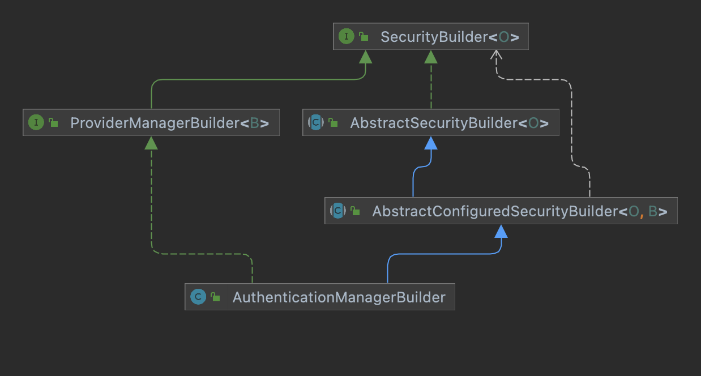

1. Tomcat, Servlet, MVC
2. FilterChain, Filter, SecurityFilterChain, SecurityFilter
3. Configurer

FormLoginConfigurer 和 ExceptionHandlingConfigurer 将自己的 LoginUrlAuthenticationEntryPoint（跳转到登陆页 /login） 配置到 ExceptionTranslationFilter 用于处理失败之后的动作


···java
protected final void registerAuthenticationEntryPoint(B http, AuthenticationEntryPoint authenticationEntryPoint) {
	ExceptionHandlingConfigurer<B> exceptionHandling = http.getConfigurer(ExceptionHandlingConfigurer.class);
	if (exceptionHandling == null) {
		return;
	}
	exceptionHandling.defaultAuthenticationEntryPointFor(postProcess(authenticationEntryPoint),
			getAuthenticationEntryPointMatcher(http));
}
···

FormLoginConfigurer 设置 UsernamePasswordAuthenticationFilter 的认证的成功处理器(跳转到重定向页面)和失败处理器(默认跳转到 /login?error)。

UsernamePasswordAuthenticationFilter 的 securityContextRepository 来自 SecurityContextConfigurer 并且 SecurityContextConfigurer 需要开启 isRequireExplicitSave

```java
SecurityContextConfigurer securityContextConfigurer = http.getConfigurer(SecurityContextConfigurer.class);
if (securityContextConfigurer != null && securityContextConfigurer.isRequireExplicitSave()) {
	SecurityContextRepository securityContextRepository = securityContextConfigurer
        .getSecurityContextRepository();
	this.authFilter.setSecurityContextRepository(securityContextRepository);
}
```

AuthenticationManager 在 HttpSecurity 构建时中使用 AuthenticationManagerBuilder 进行配置，并在 HttpSecurity.build() 创建 AuthenticationManager 对象。

AuthenticationManager 存在父子结构， 父子 AuthenticationManager 的实现类都是 ProviderManager， ProviderManager 中包含多个 AuthenticationProvider 来负责进行认证， 如果子 ProviderManager 中的 AuthenticationProvider 们无法认证将交由父 ProviderManager 中的 AuthenticationProvider 进行认证。

AuthenticationManager 本身通过 WebSecurityConfigurerAdapter.DefaultPasswordEncoderAuthenticationManagerBuilder 进行构建， 使用的是默认的 WebSecurityConfigurerAdapter.LazyPasswordEncoder 密码编码器。

父 AuthenticationManager 通过 Spring IOC 中的 DefaultPasswordEncoderAuthenticationManagerBuilder.AuthenticationManagerBuilder 进行构建的， 默认使用的是 AuthenticationConfiguration.LazyPasswordEncoder 密码编码器。

父 AuthenticationManager 会使用 IOC 容器的中的 GlobalAuthenticationConfigurerAdapter(globalAuthConfigures) 进行配置。Spring Security 会在 IOC 容器中创建 GlobalAuthenticationConfigurerAdapter， InitializeUserDetailsBeanManagerConfigurer， InitializeAuthenticationProviderBeanManagerConfigurer 三个配置器对父 AuthenticationManagerBuilder 来进行配置。将这3个配置器添加到 configures 中并在 build() 方法执行的时候进行调用。

本文将重点介绍 InitializeUserDetailsBeanManagerConfigurer 配置器： InitializeUserDetailsBeanManagerConfigurer 会在父 AuthenticationManagerBuilder 构建阶段 build() 调用。 它会创建一个 DaoAuthenticationProvider(AuthenticationProvider) 添加到父 ProviderManager 中。

DaoAuthenticationProvider 会从 IOC 中获取 UserDetailsService， PasswordEncoder， UserDetailsPasswordService 并进行配置。

AnonymousConfigurer 会在 HttpSecurity build() 时，执行 AnonymousConfigurer 的 init() 方法，该方法会向 HttpSecurity 中的 AuthenticationManagerBuilder 添加一个 AnonymousProviderManager。

HttpSecurity 会在其 beforeConfigure() 方法中从 sharedObject 中获取 AuthenticationManagerBuilder，并调用 build() 方法构建 AuthenticationManager 对象然后保存至 sharedObject 中。

## SecurityBuilder

SecurityBuilder<O> 是 Spring Security 中的重要组件的 Builder 的接口，泛型 <O> 表示 SecurityBuilder 构建出的 Spring Security 组建。

例如 HttpSecurity 构建 HttpSecurityChain 对象， AuthenticationManagerBuilder 构建 AuthenticationManger 对象。

AbstractSecurityBuilder<O> 是 SecurityBuilder 的一个抽象类，它能够确保构建的对象只能够被构建一次。

AbstractConfiguredSecurityBuilder<O, B> 继承了 AbstractSecurityBuilder<O> 类，使其能够在 AbstractSecurityBuilder<O> 功能的基础上能够通过应用 SecurityConfigurer<O, B> 来对 SecurityBuilder 进行配置。其中泛型 <O> 表示构建生成的类型，<B> 表示当前的 SecurityBuilder 类型。

之所以要添加 <B> 泛型是因为 AbstractConfiguredSecurityBuilder 中包含了多个 SecurityConfigurer<O, B> 需要对 AbstractConfiguredSecurityBuilder 进行配置，通过泛型 <B> 来限定接受的 SecurityConfigurer 类型。

AbstractConfiguredSecurityBuilder 通过 doBuild 方法构建泛型 <O> 对象。

```java
protected final O doBuild() throws Exception {
    synchronized (this.configurers) {
        this.buildState = BuildState.INITIALIZING;
        beforeInit();
        init();
        this.buildState = BuildState.CONFIGURING;
        beforeConfigure();
        configure();
        this.buildState = BuildState.BUILDING;
        O result = performBuild();
        this.buildState = BuildState.BUILT;
        return result;
    }
}

private void init() throws Exception {
    Collection<SecurityConfigurer<O, B>> configurers = getConfigurers();
    for (SecurityConfigurer<O, B> configurer : configurers) {
        configurer.init((B) this);
    }
    for (SecurityConfigurer<O, B> configurer : this.configurersAddedInInitializing) {
        configurer.init((B) this);
    }
}

private void configure() throws Exception {
    Collection<SecurityConfigurer<O, B>> configurers = getConfigurers();
    for (SecurityConfigurer<O, B> configurer : configurers) {
        configurer.configure((B) this);
    }
}

protected abstract O performBuild() throws Exception;
```



Spring Security 中有两个主要的 SecurityBuilder 分别是 AuthenticationManagerBuilder 和 HttpSecurity。

### HttpSecurity 配置流程

HttpSecurity 在 HttpSecurityConfiguration 类中创建并被添加至 IOC 容器中。在 Spring Security 的自动配置 SpringBootWebSecurityConfiguration.SecurityFilterChainConfiguration 文件中，会获取 IOC 容器中的 HttpSecurity 并对其进行进一步的配置，然后调用 build() 方法生成 SecurityFilterChain 对象。

WebSecurityConfiguration 配置类会获取 IOC 容器中的所有 SecurityFilterChain 并注入到 securityFilterChains 字段中。之后 springSecurityFilterChain 方法会使用 securityFilterChains 构建一个名为 springSecurityFilterChain 的 Filter 添加至 IOC 容器中。

并且在 AbstractSecurityWebApplicationInitializer#insertSpringSecurityFilterChain 的方法中，容器初始化器会获取名为 securityFilterChains 的 Filter，并将其注册到 servletContext 中。

### AuthenticationManagerBuilder

Spring Security 在 HttpSecurityConfiguration#httpSecurity 方法中创建 HttpSecurity 对象时会为其指定 AuthenticationManagerBuilder 来构建 Filter 中用到的 AuthenticationManager。

AuthenticationManager 会尝试对传递的 Authentication 对象（比如，UsernamePasswordAuthenticationToken 包括用户名和密码）进行身份验证，如果成功，则返回完全填充的 Authentication 对象（包括授予的权限）。

AuthenticationManager 主要实现类是 ProviderManager。ProviderManger 中包含一个 AuthenticationProvider 的列表 providers。AuthenticationProvider 和 AuthenticationManager 一样是通过 authenticate 方法对 Authentication 进行验证，除此之外还多了个 supports 方法判断 AuthenticationProvider 能否对传入的 Authentication 进行验证。 除此之外 ProviderManager 还存在一个 parent 字段用来指定 parent AuthenticationManager。

ProviderManager 的执行逻辑：

```java
public Authentication authenticate(Authentication authentication) throws AuthenticationException {
    Class<? extends Authentication> toTest = authentication.getClass();
    Authentication result = null;
    Authentication parentResult = null;
    int currentPosition = 0;
    int size = this.providers.size();
    for (AuthenticationProvider provider : getProviders()) {
        if (!provider.supports(toTest)) {
            continue;
        }
        try {
            result = provider.authenticate(authentication);
            if (result != null) {
                copyDetails(authentication, result);
                break;
            }
        }
        catch (AccountStatusException | InternalAuthenticationServiceException ex) {
            prepareException(ex, authentication);
            throw ex;
        }
        catch (AuthenticationException ex) {
            lastException = ex;
        }
    }
    if (result == null && this.parent != null) {
        try {
            parentResult = this.parent.authenticate(authentication);
            result = parentResult;
        }
        catch (AuthenticationException ex) {
            parentException = ex;
            lastException = ex;
        }
    }
    if (result != null) {
        if (this.eraseCredentialsAfterAuthentication && (result instanceof CredentialsContainer)) {
            // Authentication is complete. Remove credentials and other secret data
            // from authentication
            ((CredentialsContainer) result).eraseCredentials();
        }
        // If the parent AuthenticationManager was attempted and successful then it
        // will publish an AuthenticationSuccessEvent
        // This check prevents a duplicate AuthenticationSuccessEvent if the parent
        // AuthenticationManager already published it
        if (parentResult == null) {
            this.eventPublisher.publishAuthenticationSuccess(result);
        }

        return result;
    }
    // ...
}
```

Spring Security 会使用 WebSecurityConfigurerAdapter.DefaultPasswordEncoderAuthenticationManagerBuilder 作为 HttpSecurity 的 AuthenticationManagerBuilder，为其生成一个实现类为 ProviderManager 的 AuthenticationManager，同时还会为指定一个 parent AuthenticationManager。

#### parent AuthenticationManager 创建流程

```java
WebSecurityConfigurerAdapter.LazyPasswordEncoder passwordEncoder = new WebSecurityConfigurerAdapter.LazyPasswordEncoder(
        this.context);
AuthenticationManagerBuilder authenticationBuilder = new WebSecurityConfigurerAdapter.DefaultPasswordEncoderAuthenticationManagerBuilder(
        this.objectPostProcessor, passwordEncoder);
authenticationBuilder.parentAuthenticationManager(authenticationManager());
HttpSecurity http = new HttpSecurity(this.objectPostProcessor, authenticationBuilder, createSharedObjects());
```

parent AuthenticationManager 默认会使用 IOC 容器中的 AuthenticationConfiguration 的 getAuthenticationManager 方法来获取 AuthenticationManager 对象。

```java
private List<GlobalAuthenticationConfigurerAdapter> globalAuthConfigurers = Collections.emptyList();

public AuthenticationManager getAuthenticationManager() throws Exception {
    if (this.authenticationManagerInitialized) {
        return this.authenticationManager;
    }
    // 从容器中获取 AuthenticationManagerBuilder
    // 默认使用从 AuthenticationConfiguration.authenticationManagerBuilder 创建的
    // DefaultPasswordEncoderAuthenticationManagerBuilder，其 PasswordEncoder 和
    // AuthenticationEventPublisher 都是从容器中获取的
    AuthenticationManagerBuilder authBuilder = this.applicationContext.getBean(AuthenticationManagerBuilder.class);
    if (this.buildingAuthenticationManager.getAndSet(true)) {
        return new AuthenticationManagerDelegator(authBuilder);
    }
    // 获取容器中的 AuthenticationManagerBuilder 配置器 GlobalAuthenticationConfigurerAdapter
    // 默认有三个 GlobalAuthenticationConfigurerAdapter， InitializeUserDetailsBeanManagerConfigurer 和
    // InitializeAuthenticationProviderBeanManagerConfigurer
    for (GlobalAuthenticationConfigurerAdapter config : this.globalAuthConfigurers) {
        authBuilder.apply(config);
    }
    // 构建 AuthenticationManager 对象
    this.authenticationManager = authBuilder.build();
    if (this.authenticationManager == null) {
        this.authenticationManager = getAuthenticationManagerBean();
    }
    this.authenticationManagerInitialized = true;
    return this.authenticationManager;
}

@Autowired(required = false)
public void setGlobalAuthenticationConfigurers(List<GlobalAuthenticationConfigurerAdapter> configurers) {
    configurers.sort(AnnotationAwareOrderComparator.INSTANCE);
    this.globalAuthConfigurers = configurers;
}
```

需要注意的是，parent AuthenticationManagerBuilder 应用的 InitializeUserDetailsBeanManagerConfigurer 会在构建时调用其 InitializeUserDetailsBeanManagerConfigurer#configure() 方法。

```java
public void configure(AuthenticationManagerBuilder auth) throws Exception {
    if (auth.isConfigured()) {
        return;
    }
    // 从容器中获取 UserDetailsService 对象
    UserDetailsService userDetailsService = getBeanOrNull(UserDetailsService.class);
    if (userDetailsService == null) {
        return;
    }
    // 从容器中获取 PasswordEncoder
    PasswordEncoder passwordEncoder = getBeanOrNull(PasswordEncoder.class);
    // 从容器中获取 UserDetailsPasswordService
    UserDetailsPasswordService passwordManager = getBeanOrNull(UserDetailsPasswordService.class);
    DaoAuthenticationProvider provider = new DaoAuthenticationProvider();
    provider.setUserDetailsService(userDetailsService);
    if (passwordEncoder != null) {
        provider.setPasswordEncoder(passwordEncoder);
    }
    if (passwordManager != null) {
        provider.setUserDetailsPasswordService(passwordManager);
    }
    provider.afterPropertiesSet();
    // 将 authenticationProvider 加入到 ProviderManager 的 provider 列表中
    auth.authenticationProvider(provider);
}
```

#### AuthenticationManager 创建配置流程

HttpSecurity 中 AuthenticationManagerBuilder 配置的 PasswordEncoder 都是写死的，而 parent AuthenticationManagerBuilder 的是从 IOC 中获取的。

```java
WebSecurityConfigurerAdapter.LazyPasswordEncoder passwordEncoder = new WebSecurityConfigurerAdapter.LazyPasswordEncoder(
        this.context);
AuthenticationManagerBuilder authenticationBuilder = new WebSecurityConfigurerAdapter.DefaultPasswordEncoderAuthenticationManagerBuilder(
        this.objectPostProcessor, passwordEncoder);
authenticationBuilder.parentAuthenticationManager(authenticationManager());
HttpSecurity http = new HttpSecurity(this.objectPostProcessor, authenticationBuilder, createSharedObjects());
```

之后让我们看看 AuthenticationManagerBuilder 传入到 HttpSecurity 被如何使用。

```java
public HttpSecurity(ObjectPostProcessor<Object> objectPostProcessor,
        AuthenticationManagerBuilder authenticationBuilder, Map<Class<?>, Object> sharedObjects) {
    super(objectPostProcessor);
    Assert.notNull(authenticationBuilder, "authenticationBuilder cannot be null");
    setSharedObject(AuthenticationManagerBuilder.class, authenticationBuilder);
    for (Map.Entry<Class<?>, Object> entry : sharedObjects.entrySet()) {
        setSharedObject((Class<Object>) entry.getKey(), entry.getValue());
    }
    ApplicationContext context = (ApplicationContext) sharedObjects.get(ApplicationContext.class);
    this.requestMatcherConfigurer = new RequestMatcherConfigurer(context);
}

private AuthenticationManagerBuilder getAuthenticationRegistry() {
    return getSharedObject(AuthenticationManagerBuilder.class);
}

protected void beforeConfigure() throws Exception {
    // 设置 sharedObject 以供其他 configurer 使用，所以放在 beforeConfigure 方法中
    if (this.authenticationManager != null) {
        setSharedObject(AuthenticationManager.class, this.authenticationManager);
    }
    else {
        setSharedObject(AuthenticationManager.class, getAuthenticationRegistry().build());
    }
}
```

